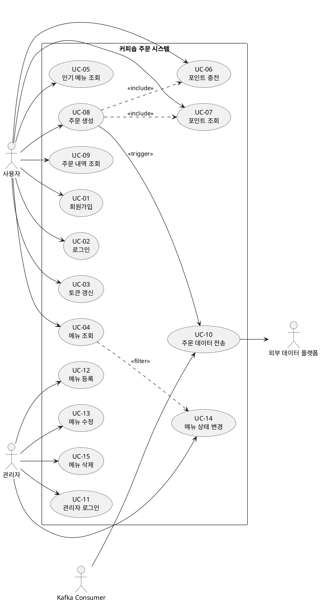

# 유스케이스 명세서

## 1. 문서 개요

이 문서는 커피숍 주문 시스템의 유스케이스를 정의하고, 각 유스케이스의 상세 명세를 제공합니다.

---

## 2. 액터 (Actors)

| 액터 | 설명 | 역할 |
|------|------|------|
| **사용자 (User)** | 커피를 주문하는 고객 | 회원가입, 로그인, 포인트 충전, 주문, 메뉴 조회 |
| **관리자 (Admin)** | 커피숍 운영자 | 메뉴 관리, 재고 관리, 메뉴 상태 변경 |
| **시스템 (System)** | 커피숍 주문 시스템 | 주문 처리, 포인트 관리, 인기 메뉴 집계 |
| **외부 데이터 플랫폼 (External Platform)** | 주문 데이터를 수집하는 외부 시스템 | 주문 데이터 수신 |
| **Kafka Consumer** | 비동기 이벤트 처리 시스템 | 주문 이벤트 소비, 외부 API 전송 |

---

## 3. 유스케이스 다이어그램 (PlantUML)



---

## 4. 유스케이스 목록

| ID | 유스케이스명 | 액터 | 우선순위 | 복잡도 |
|----|--------------|------|----------|--------|
| UC-01 | 회원가입 | 사용자 | High | 중 |
| UC-02 | 로그인 | 사용자 | High | 중 |
| UC-03 | 토큰 갱신 | 사용자 | High | 낮 |
| UC-04 | 메뉴 조회 | 사용자 | High | 낮 |
| UC-05 | 인기 메뉴 조회 | 사용자 | High | 중 |
| UC-06 | 포인트 충전 | 사용자 | High | 중 |
| UC-07 | 포인트 조회 | 사용자 | High | 낮 |
| UC-08 | 주문 생성 | 사용자 | Critical | 높 |
| UC-09 | 주문 내역 조회 | 사용자 | Medium | 낮 |
| UC-10 | 주문 데이터 전송 | Kafka Consumer | High | 중 |
| UC-11 | 관리자 로그인 | 관리자 | High | 중 |
| UC-12 | 메뉴 등록 | 관리자 | High | 중 |
| UC-13 | 메뉴 수정 | 관리자 | Medium | 낮 |
| UC-14 | 메뉴 상태 변경 | 관리자 | High | 낮 |
| UC-15 | 메뉴 삭제 | 관리자 | Low | 낮 |

---

## 5. 유스케이스 상세 명세

### UC-01: 회원가입

**목적**: 신규 사용자가 시스템에 가입하여 계정을 생성한다.

**액터**: 사용자

**사전 조건**: 
- 사용자가 앱을 설치했음
- 인터넷 연결 가능

**사후 조건**:
- 사용자 계정이 생성됨
- JWT Access Token + Refresh Token 발급
- 초기 포인트 0P로 설정

**주요 시나리오**:
1. 사용자가 "회원가입" 버튼 클릭
2. 시스템이 회원가입 폼 표시
3. 사용자가 이메일, 비밀번호, 이름 입력
4. 시스템이 입력값 검증
   - 이메일 형식 검증
   - 비밀번호 강도 검증 (최소 8자, 영문+숫자)
   - 이메일 중복 확인
5. 시스템이 비밀번호를 BCrypt로 해싱 (strength 10)
6. 시스템이 사용자 정보를 DB에 저장
7. 시스템이 JWT Access Token (1시간) + Refresh Token (7일) 발급
8. 시스템이 Refresh Token을 Redis에 저장
9. 시스템이 회원가입 완료 응답 반환

**대안 시나리오**:
- **4a. 이메일 형식 오류**
  - 시스템이 "올바른 이메일 형식을 입력해주세요" 에러 반환
  - 사용자가 이메일 재입력
- **4b. 이메일 중복**
  - 시스템이 "이미 가입된 이메일입니다" 에러 반환
  - 사용자가 로그인 화면으로 이동
- **4c. 비밀번호 강도 부족**
  - 시스템이 "비밀번호는 최소 8자, 영문+숫자 조합이어야 합니다" 에러 반환
  - 사용자가 비밀번호 재입력

**비기능 요구사항**:
- 응답 시간: < 1초
- 비밀번호 해싱: BCrypt strength 10
- JWT Secret: 환경변수로 관리

---

### UC-02: 로그인

**목적**: 기존 사용자가 시스템에 로그인하여 인증을 받는다.

**액터**: 사용자

**사전 조건**:
- 사용자가 이미 회원가입했음
- 인터넷 연결 가능

**사후 조건**:
- 사용자가 인증됨
- JWT Access Token + Refresh Token 발급
- 사용자가 시스템 기능 사용 가능

**주요 시나리오**:
1. 사용자가 "로그인" 버튼 클릭
2. 시스템이 로그인 폼 표시
3. 사용자가 이메일, 비밀번호 입력
4. 시스템이 이메일로 사용자 조회
5. 시스템이 입력된 비밀번호와 저장된 해시 비교 (BCrypt)
6. 시스템이 JWT Access Token (1시간) + Refresh Token (7일) 발급
7. 시스템이 Refresh Token을 Redis에 저장 (기존 토큰 덮어쓰기)
8. 시스템이 로그인 성공 응답 반환

**대안 시나리오**:
- **4a. 사용자 없음**
  - 시스템이 "이메일 또는 비밀번호가 일치하지 않습니다" 에러 반환
- **5a. 비밀번호 불일치**
  - 시스템이 "이메일 또는 비밀번호가 일치하지 않습니다" 에러 반환
  - 로그인 실패 횟수 증가 (5회 초과 시 계정 잠금 - 향후 확장)

**비기능 요구사항**:
- 응답 시간: < 500ms
- 보안: 이메일/비밀번호 오류 메시지 동일 (계정 존재 여부 노출 방지)

---

### UC-03: 토큰 갱신

**목적**: Access Token 만료 시 Refresh Token으로 새 Access Token을 발급받는다.

**액터**: 사용자

**사전 조건**:
- Access Token이 만료됨
- Refresh Token이 유효함

**사후 조건**:
- 새로운 Access Token 발급
- 사용자가 재로그인 없이 계속 사용 가능

**주요 시나리오**:
1. 사용자가 API 요청 시 Access Token 만료 감지
2. 클라이언트가 자동으로 토큰 갱신 API 호출
3. 시스템이 Refresh Token 검증
4. 시스템이 Redis에서 Refresh Token 존재 확인
5. 시스템이 새로운 Access Token (1시간) 발급
6. 시스템이 토큰 갱신 성공 응답 반환
7. 클라이언트가 새 Access Token으로 원래 요청 재시도

**대안 시나리오**:
- **3a. Refresh Token 만료**
  - 시스템이 "인증이 만료되었습니다" 에러 반환
  - 클라이언트가 로그인 화면으로 이동
- **4a. Refresh Token이 Redis에 없음**
  - 시스템이 "유효하지 않은 토큰입니다" 에러 반환
  - 클라이언트가 로그인 화면으로 이동

**비기능 요구사항**:
- 응답 시간: < 200ms
- 사용자 경험: 자동 갱신으로 사용자가 인지하지 못함

---

### UC-04: 메뉴 조회

**목적**: 사용자가 주문 가능한 커피 메뉴 목록을 조회한다.

**액터**: 사용자

**사전 조건**:
- 사용자가 로그인되어 있음

**사후 조건**:
- 메뉴 목록이 표시됨

**주요 시나리오**:
1. 사용자가 "메뉴 보기" 버튼 클릭
2. 시스템이 JWT 토큰 검증
3. 시스템이 DB에서 전체 메뉴 조회 (상태가 '판매중'인 메뉴만)
   ```sql
   SELECT * FROM menus WHERE status = 'AVAILABLE' ORDER BY name
   ```
4. 시스템이 메뉴 목록 반환 (메뉴ID, 이름, 가격, 상태)
5. 클라이언트가 메뉴 목록 표시

**대안 시나리오**:
- **2a. JWT 토큰 만료**
  - 시스템이 자동으로 토큰 갱신 (UC-03)
- **3a. 판매중인 메뉴 없음**
  - 시스템이 빈 목록 반환
  - 클라이언트가 "현재 주문 가능한 메뉴가 없습니다" 메시지 표시

**비기능 요구사항**:
- 응답 시간: < 300ms
- 메뉴 개수: 최대 100개 (페이지네이션 없음)

---

### UC-05: 인기 메뉴 조회

**목적**: 최근 7일간 주문 횟수 기준 상위 3개 메뉴를 조회한다.

**액터**: 사용자

**사전 조건**:
- 사용자가 로그인되어 있음

**사후 조건**:
- 인기 메뉴 3개가 표시됨

**주요 시나리오**:
1. 사용자가 메인 화면 진입 (자동 호출)
2. 시스템이 JWT 토큰 검증
3. 시스템이 Redis 캐시에서 인기 메뉴 조회 (키: `popular_menus`)
4. **캐시 히트**: 시스템이 캐시된 인기 메뉴 반환
5. 클라이언트가 인기 메뉴 표시

**대안 시나리오**:
- **3a. 캐시 미스**
  - 시스템이 DB에서 인기 메뉴 집계
    ```sql
    SELECT menu_id, SUM(order_count) as total_count
    FROM menu_statistics
    WHERE order_date >= CURDATE() - INTERVAL 7 DAY
    GROUP BY menu_id
    ORDER BY total_count DESC
    LIMIT 3
    ```
  - 시스템이 결과를 Redis에 캐싱 (TTL 5분)
  - 시스템이 인기 메뉴 반환
- **4a. 인기 메뉴 3개 미만**
  - 시스템이 존재하는 메뉴만 반환 (1~2개)
- **4b. 주문 내역 없음**
  - 시스템이 빈 목록 반환
  - 클라이언트가 "아직 주문 내역이 없습니다" 메시지 표시

**비기능 요구사항**:
- 응답 시간: < 200ms (캐시 히트), < 500ms (캐시 미스)
- 정확성: 주문 횟수 오차 0%
- 캐시 TTL: 5분

---

### UC-06: 포인트 충전

**목적**: 사용자가 포인트를 충전하여 주문에 사용할 수 있도록 한다.

**액터**: 사용자

**사전 조건**:
- 사용자가 로그인되어 있음

**사후 조건**:
- 사용자의 포인트 잔액이 증가함

**주요 시나리오**:
1. 사용자가 "포인트 충전" 버튼 클릭
2. 시스템이 충전 화면 표시 (5,000원 / 10,000원 / 30,000원)
3. 사용자가 충전 금액 선택
4. 시스템이 JWT 토큰 검증
5. 시스템이 트랜잭션 시작
6. 시스템이 사용자 포인트 조회 (비관적 락)
   ```sql
   SELECT * FROM user_points WHERE user_id = ? FOR UPDATE
   ```
7. 시스템이 포인트 증가 (1원 = 1P)
8. 시스템이 포인트 충전 이력 저장
9. 시스템이 트랜잭션 커밋
10. 시스템이 충전 성공 응답 반환 (새 잔액 포함)

**대안 시나리오**:
- **4a. JWT 토큰 만료**
  - 시스템이 자동으로 토큰 갱신 (UC-03)
- **6a. 사용자 포인트 레코드 없음**
  - 시스템이 새 레코드 생성 (초기 잔액 0P)
  - 시나리오 7번으로 진행
- **9a. 트랜잭션 실패**
  - 시스템이 롤백
  - 시스템이 "충전에 실패했습니다" 에러 반환

**비기능 요구사항**:
- 응답 시간: < 1초
- 동시성: 비관적 락으로 동시 충전 방지
- 최대 충전 금액: 1,000,000원 (1회)

---

### UC-07: 포인트 조회

**목적**: 사용자가 현재 포인트 잔액을 조회한다.

**액터**: 사용자

**사전 조건**:
- 사용자가 로그인되어 있음

**사후 조건**:
- 포인트 잔액이 표시됨

**주요 시나리오**:
1. 사용자가 메인 화면 진입 (자동 호출)
2. 시스템이 JWT 토큰 검증
3. 시스템이 DB에서 사용자 포인트 조회
4. 시스템이 포인트 잔액 반환
5. 클라이언트가 포인트 잔액 표시

**대안 시나리오**:
- **3a. 포인트 레코드 없음**
  - 시스템이 0P 반환

**비기능 요구사항**:
- 응답 시간: < 200ms

---

### UC-08: 주문 생성 ⭐ (핵심)

**목적**: 사용자가 메뉴를 선택하고 포인트로 결제하여 주문을 생성한다.

**액터**: 사용자

**사전 조건**:
- 사용자가 로그인되어 있음
- 포인트 잔액이 충분함

**사후 조건**:
- 주문이 생성됨
- 포인트가 차감됨
- 인기 메뉴 집계가 업데이트됨
- Kafka 이벤트가 발행됨

**주요 시나리오**:
1. 사용자가 메뉴 선택
2. 사용자가 "주문하기" 버튼 클릭
3. 시스템이 JWT 토큰 검증
4. 시스템이 Redis 분산 락 획득 (키: `lock:user:{userId}:point`, 타임아웃 3초)
5. 시스템이 트랜잭션 시작 (격리 수준: READ_COMMITTED)
6. 시스템이 메뉴 정보 조회 (가격 확인 + 상태 확인)
   ```sql
   SELECT * FROM menus WHERE menu_id = ? AND status = 'AVAILABLE'
   ```
7. 시스템이 메뉴 상태 검증 (판매중인지 확인)
8. 시스템이 사용자 포인트 조회 (비관적 락)
   ```sql
   SELECT * FROM user_points WHERE user_id = ? FOR UPDATE
   ```
9. 시스템이 포인트 잔액 검증 (잔액 >= 메뉴 가격)
10. 시스템이 포인트 차감
10. 시스템이 주문 생성 (주문ID, 사용자ID, 메뉴ID, 가격, 주문시간)
11. 시스템이 인기 메뉴 집계 테이블 업데이트
    ```sql
    INSERT INTO menu_statistics (menu_id, order_date, order_count)
    VALUES (?, CURDATE(), 1)
    ON DUPLICATE KEY UPDATE order_count = order_count + 1
    ```
12. 시스템이 Kafka 이벤트 발행 (토픽: `order-events`)
    ```json
    {
      "orderId": 123,
      "userId": 456,
      "menuId": 789,
      "price": 4500,
      "orderTime": "2026-05-06T10:30:00"
    }
    ```
13. 시스템이 트랜잭션 커밋
14. 시스템이 Redis 분산 락 해제
15. 시스템이 주문 성공 응답 반환 (주문ID, 잔여 포인트)

**대안 시나리오**:
- **4a. 분산 락 획득 실패 (타임아웃)**
  - 시스템이 "잠시 후 다시 시도해주세요" 에러 반환
- **7a. 메뉴가 품절 상태**
  - 시스템이 트랜잭션 롤백
  - 시스템이 분산 락 해제
  - 시스템이 "해당 메뉴는 현재 품절입니다" 에러 반환
- **9a. 포인트 부족**
  - 시스템이 트랜잭션 롤백
  - 시스템이 분산 락 해제
  - 시스템이 "포인트가 부족합니다" 에러 반환
- **12a. Kafka 발행 실패**
  - 시스템이 트랜잭션 롤백
  - 시스템이 분산 락 해제
  - 시스템이 "주문에 실패했습니다" 에러 반환
- **13a. 트랜잭션 커밋 실패**
  - 시스템이 롤백
  - 시스템이 분산 락 해제
  - 시스템이 "주문에 실패했습니다" 에러 반환

**비기능 요구사항**:
- 응답 시간: < 200ms (95 percentile)
- 동시성: Redis 분산 락 + MySQL 비관적 락
- 정합성: 포인트 마이너스 절대 불가
- 트랜잭션 격리 수준: READ_COMMITTED

---

### UC-09: 주문 내역 조회

**목적**: 사용자가 자신의 주문 내역을 조회한다.

**액터**: 사용자

**사전 조건**:
- 사용자가 로그인되어 있음

**사후 조건**:
- 주문 내역 목록이 표시됨

**주요 시나리오**:
1. 사용자가 "주문 내역" 버튼 클릭
2. 시스템이 JWT 토큰 검증
3. 시스템이 DB에서 사용자의 주문 내역 조회 (최근 30일)
4. 시스템이 주문 내역 반환 (주문ID, 메뉴명, 가격, 주문시간)
5. 클라이언트가 주문 내역 표시

**대안 시나리오**:
- **3a. 주문 내역 없음**
  - 시스템이 빈 목록 반환
  - 클라이언트가 "주문 내역이 없습니다" 메시지 표시

**비기능 요구사항**:
- 응답 시간: < 500ms
- 조회 기간: 최근 30일

---

### UC-11: 관리자 로그인

**목적**: 관리자가 시스템에 로그인하여 관리 기능에 접근한다.

**액터**: 관리자

**사전 조건**:
- 관리자 계정이 미리 생성되어 있음
- 인터넷 연결 가능

**사후 조건**:
- 관리자가 인증됨
- JWT Access Token + Refresh Token 발급 (role: ADMIN)
- 관리자 기능 사용 가능

**주요 시나리오**:
1. 관리자가 관리자 로그인 페이지 접속
2. 시스템이 로그인 폼 표시
3. 관리자가 이메일, 비밀번호 입력
4. 시스템이 이메일로 사용자 조회
5. 시스템이 사용자 역할(role) 확인 (ADMIN인지 검증)
6. 시스템이 비밀번호 검증 (BCrypt)
7. 시스템이 JWT Access Token + Refresh Token 발급 (role: ADMIN 포함)
8. 시스템이 Refresh Token을 Redis에 저장
9. 시스템이 로그인 성공 응답 반환

**대안 시나리오**:
- **5a. 관리자 권한 없음**
  - 시스템이 "관리자 권한이 없습니다" 에러 반환
- **6a. 비밀번호 불일치**
  - 시스템이 "이메일 또는 비밀번호가 일치하지 않습니다" 에러 반환

**비기능 요구사항**:
- 응답 시간: < 500ms
- 보안: 관리자 권한 검증 필수

---

### UC-12: 메뉴 등록

**목적**: 관리자가 새로운 메뉴를 등록한다.

**액터**: 관리자

**사전 조건**:
- 관리자가 로그인되어 있음

**사후 조건**:
- 새로운 메뉴가 DB에 저장됨
- 메뉴 상태는 '판매중'으로 설정됨

**주요 시나리오**:
1. 관리자가 "메뉴 등록" 버튼 클릭
2. 시스템이 메뉴 등록 폼 표시
3. 관리자가 메뉴 정보 입력
   - 메뉴명 (예: 아메리카노)
   - 가격 (예: 4,500원)
   - 설명 (선택)
   - 필요 재료 태그 (예: 원두, 물)
4. 시스템이 JWT 토큰 검증 (role: ADMIN)
5. 시스템이 입력값 검증
   - 메뉴명 중복 확인
   - 가격 범위 확인 (100원 ~ 100,000원)
6. 시스템이 메뉴 저장 (상태: AVAILABLE)
7. 시스템이 등록 성공 응답 반환

**대안 시나리오**:
- **5a. 메뉴명 중복**
  - 시스템이 "이미 존재하는 메뉴명입니다" 에러 반환
- **5b. 가격 범위 초과**
  - 시스템이 "가격은 100원 ~ 100,000원 사이여야 합니다" 에러 반환

**비기능 요구사항**:
- 응답 시간: < 1초
- 권한: ADMIN 역할만 접근 가능

---

### UC-13: 메뉴 수정

**목적**: 관리자가 기존 메뉴 정보를 수정한다.

**액터**: 관리자

**사전 조건**:
- 관리자가 로그인되어 있음
- 수정할 메뉴가 존재함

**사후 조건**:
- 메뉴 정보가 업데이트됨

**주요 시나리오**:
1. 관리자가 메뉴 목록에서 수정할 메뉴 선택
2. 시스템이 메뉴 수정 폼 표시 (기존 정보 표시)
3. 관리자가 수정할 정보 입력 (메뉴명, 가격, 설명, 재료 태그)
4. 시스템이 JWT 토큰 검증 (role: ADMIN)
5. 시스템이 입력값 검증
6. 시스템이 메뉴 정보 업데이트
7. 시스템이 수정 성공 응답 반환

**대안 시나리오**:
- **1a. 메뉴 없음**
  - 시스템이 "존재하지 않는 메뉴입니다" 에러 반환

**비기능 요구사항**:
- 응답 시간: < 1초
- 권한: ADMIN 역할만 접근 가능

---

### UC-14: 메뉴 상태 변경 ⭐ (재고 관리)

**목적**: 관리자가 재료 소진 시 해당 메뉴를 품절 처리한다.

**액터**: 관리자

**사전 조건**:
- 관리자가 로그인되어 있음
- 변경할 메뉴가 존재함

**사후 조건**:
- 메뉴 상태가 변경됨 (판매중 ↔ 품절)
- 품절된 메뉴는 사용자에게 노출되지 않음

**주요 시나리오**:
1. 관리자가 재료 상태 확인 (예: 원두 소진)
2. 관리자가 메뉴 목록에서 해당 재료가 필요한 메뉴 확인
3. 관리자가 메뉴 상태 변경 버튼 클릭 (판매중 → 품절)
4. 시스템이 JWT 토큰 검증 (role: ADMIN)
5. 시스템이 메뉴 상태 업데이트
   ```sql
   UPDATE menus SET status = 'SOLD_OUT', updated_at = NOW()
   WHERE menu_id = ?
   ```
6. 시스템이 Redis 캐시 무효화 (인기 메뉴 캐시 삭제)
7. 시스템이 상태 변경 성공 응답 반환

**대안 시나리오**:
- **3a. 재료 입고 시 품절 → 판매중 전환**
  - 관리자가 "판매 재개" 버튼 클릭
  - 시스템이 메뉴 상태를 AVAILABLE로 변경
  - 시스템이 Redis 캐시 무효화

**비기능 요구사항**:
- 응답 시간: < 500ms
- 권한: ADMIN 역할만 접근 가능
- 실시간 반영: 상태 변경 즉시 사용자 화면에 반영

**설계 의도**:
- 자동 재고 관리 대신 **수동 관리**로 단순화
- 관리자가 실제 재료 상태를 보고 판단
- 복잡한 재고 테이블 불필요 (메뉴 상태만으로 관리)

---

### UC-15: 메뉴 삭제

**목적**: 관리자가 더 이상 판매하지 않는 메뉴를 삭제한다.

**액터**: 관리자

**사전 조건**:
- 관리자가 로그인되어 있음
- 삭제할 메뉴가 존재함

**사후 조건**:
- 메뉴가 논리 삭제됨 (deleted_at 설정)
- 사용자에게 노출되지 않음

**주요 시나리오**:
1. 관리자가 메뉴 목록에서 삭제할 메뉴 선택
2. 관리자가 "삭제" 버튼 클릭
3. 시스템이 삭제 확인 팝업 표시
4. 관리자가 "확인" 클릭
5. 시스템이 JWT 토큰 검증 (role: ADMIN)
6. 시스템이 메뉴 논리 삭제 (deleted_at = NOW())
7. 시스템이 Redis 캐시 무효화
8. 시스템이 삭제 성공 응답 반환

**대안 시나리오**:
- **6a. 주문 내역이 있는 메뉴**
  - 시스템이 물리 삭제 대신 논리 삭제 수행
  - 주문 내역 조회 시 메뉴명 유지

**비기능 요구사항**:
- 응답 시간: < 500ms
- 권한: ADMIN 역할만 접근 가능
- 데이터 무결성: 논리 삭제로 주문 내역 보존

---

### UC-10: 주문 데이터 전송 (비동기)

**목적**: 주문 데이터를 외부 데이터 플랫폼으로 전송한다.

**액터**: Kafka Consumer

**사전 조건**:
- Kafka 토픽에 주문 이벤트가 발행됨

**사후 조건**:
- 외부 플랫폼에 주문 데이터가 전송됨

**주요 시나리오**:
1. Kafka Consumer가 `order-events` 토픽에서 이벤트 소비
2. Consumer가 이벤트 데이터 파싱
3. Consumer가 외부 API 호출 (타임아웃 3초)
   ```http
   POST /api/orders
   Content-Type: application/json
   
   {
     "userId": 456,
     "menuId": 789,
     "price": 4500
   }
   ```
4. 외부 API가 200 OK 응답
5. Consumer가 Kafka에 ACK 전송 (커밋)

**대안 시나리오**:
- **3a. 외부 API 타임아웃**
  - Consumer가 재시도 (최대 3회, 지수 백오프)
  - 1차 재시도: 2초 후
  - 2차 재시도: 4초 후
  - 3차 재시도: 8초 후
- **3b. 3회 재시도 모두 실패**
  - Consumer가 이벤트를 Dead Letter Queue (DLQ)로 이동
  - Consumer가 에러 로그 기록
  - 관리자에게 알림 (향후 확장)
- **4a. 외부 API 4xx/5xx 에러**
  - 4xx (클라이언트 오류): DLQ로 즉시 이동 (재시도 불필요)
  - 5xx (서버 오류): 재시도 (3a 시나리오)

**비기능 요구사항**:
- 재시도 횟수: 최대 3회
- 타임아웃: 3초
- 최종 전송 성공률: > 99%

---

## 6. 유스케이스 간 관계

### Include 관계
- **UC-08 (주문 생성)** includes **UC-06 (포인트 충전)**: 포인트 부족 시 충전 필요
- **UC-08 (주문 생성)** includes **UC-07 (포인트 조회)**: 주문 전 잔액 확인
- **UC-08 (주문 생성)** includes **UC-14 (메뉴 상태 변경)**: 품절 메뉴 주문 불가

### Extend 관계
- **UC-03 (토큰 갱신)** extends **모든 인증 필요 UC**: Access Token 만료 시 자동 갱신

### Trigger 관계
- **UC-08 (주문 생성)** triggers **UC-10 (주문 데이터 전송)**: 주문 완료 시 Kafka 이벤트 발행

### Filter 관계
- **UC-04 (메뉴 조회)** filters by **UC-14 (메뉴 상태)**: 판매중인 메뉴만 조회

---

## 7. 비기능 요구사항 매트릭스

| 유스케이스 | 응답 시간 | 동시성 제어 | 트랜잭션 | 캐싱 | 권한 |
|------------|-----------|-------------|----------|------|------|
| UC-01 | < 1초 | ❌ | ✅ | ❌ | USER |
| UC-02 | < 500ms | ❌ | ❌ | ❌ | USER |
| UC-03 | < 200ms | ❌ | ❌ | ✅ (Redis) | USER |
| UC-04 | < 300ms | ❌ | ❌ | ❌ | USER |
| UC-05 | < 200ms | ❌ | ❌ | ✅ (Redis) | USER |
| UC-06 | < 1초 | ✅ (비관적 락) | ✅ | ❌ | USER |
| UC-07 | < 200ms | ❌ | ❌ | ❌ | USER |
| UC-08 | < 200ms | ✅ (분산 락 + 비관적 락) | ✅ | ❌ | USER |
| UC-09 | < 500ms | ❌ | ❌ | ❌ | USER |
| UC-10 | 비동기 | ❌ | ❌ | ❌ | SYSTEM |
| UC-11 | < 500ms | ❌ | ❌ | ❌ | ADMIN |
| UC-12 | < 1초 | ❌ | ✅ | ❌ | ADMIN |
| UC-13 | < 1초 | ❌ | ✅ | ❌ | ADMIN |
| UC-14 | < 500ms | ❌ | ✅ | ✅ (무효화) | ADMIN |
| UC-15 | < 500ms | ❌ | ✅ | ✅ (무효화) | ADMIN |

---

## 8. 다음 단계

1. ✅ 프로젝트 개요서 작성 완료
2. ✅ 사용자 시나리오 (페르소나 포함) 작성 완료
3. ✅ **유스케이스 명세서** 작성 완료
4. ⏭️ 기능 명세서
5. ⏭️ ERD 설계
6. ⏭️ API 명세서
7. ⏭️ 화면 설계서
8. ⏭️ 인프라 아키텍처 다이어그램
9. ⏭️ 동시성 제어 설계서 ⭐
10. ⏭️ ADR (Architecture Decision Record)

---

## 문서 이력

| 버전 | 작성일 | 작성자 | 변경 내역 |
|------|--------|--------|-----------|
| 1.0 | 2026-05-06 | Kiro | 초안 작성 |
| 1.1 | 2026-05-06 | Kiro | 관리자 기능 추가 (UC-11~15), 메뉴 상태 관리 |
