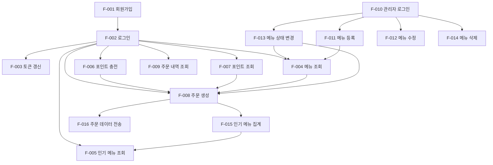

# 기능 명세서

## 1. 문서 개요

이 문서는 커피숍 주문 시스템의 각 기능에 대한 상세 명세를 제공합니다.

---

## 2. 기능 분류

### 2.1 사용자 기능
- 인증/인가
- 메뉴 조회
- 포인트 관리
- 주문/결제
- 주문 내역

### 2.2 관리자 기능
- 관리자 인증
- 메뉴 관리 (CRUD)
- 메뉴 상태 관리 (재고)

### 2.3 시스템 기능
- 인기 메뉴 집계
- 주문 데이터 전송 (비동기)

---

## 3. 사용자 기능 상세

### 3.1 인증/인가

#### 3.1.1 회원가입

**기능 ID**: F-001

**기능 설명**: 신규 사용자가 이메일, 비밀번호, 이름을 입력하여 계정을 생성한다.

**입력**:
| 필드 | 타입 | 필수 | 제약사항 | 예시 |
|------|------|------|----------|------|
| email | String | ✅ | 이메일 형식, 최대 100자 | user@example.com |
| password | String | ✅ | 최소 8자, 영문+숫자 조합 | Password123 |
| name | String | ✅ | 최소 2자, 최대 50자 | 홍길동 |

**출력**:
| 필드 | 타입 | 설명 |
|------|------|------|
| userId | Long | 생성된 사용자 ID |
| accessToken | String | JWT Access Token (1시간) |
| refreshToken | String | JWT Refresh Token (7일) |
| message | String | 성공 메시지 |

**비즈니스 규칙**:
1. 이메일 중복 불가
2. 비밀번호는 BCrypt로 해싱 (strength 10)
3. 초기 포인트 0P로 설정
4. 사용자 역할(role)은 USER로 설정

**에러 케이스**:
| 에러 코드 | 메시지 | HTTP 상태 |
|-----------|--------|-----------|
| AUTH_001 | 이미 가입된 이메일입니다 | 409 Conflict |
| AUTH_002 | 올바른 이메일 형식을 입력해주세요 | 400 Bad Request |
| AUTH_003 | 비밀번호는 최소 8자, 영문+숫자 조합이어야 합니다 | 400 Bad Request |

---

#### 3.1.2 로그인

**기능 ID**: F-002

**기능 설명**: 기존 사용자가 이메일과 비밀번호로 로그인한다.

**입력**:
| 필드 | 타입 | 필수 | 제약사항 | 예시 |
|------|------|------|----------|------|
| email | String | ✅ | 이메일 형식 | user@example.com |
| password | String | ✅ | - | Password123 |

**출력**:
| 필드 | 타입 | 설명 |
|------|------|------|
| userId | Long | 사용자 ID |
| accessToken | String | JWT Access Token (1시간) |
| refreshToken | String | JWT Refresh Token (7일) |
| name | String | 사용자 이름 |
| pointBalance | Integer | 현재 포인트 잔액 |

**비즈니스 규칙**:
1. 이메일과 비밀번호 일치 확인
2. 기존 Refresh Token 덮어쓰기 (Redis)
3. 로그인 실패 시 에러 메시지 동일 (보안)

**에러 케이스**:
| 에러 코드 | 메시지 | HTTP 상태 |
|-----------|--------|-----------|
| AUTH_004 | 이메일 또는 비밀번호가 일치하지 않습니다 | 401 Unauthorized |

---

#### 3.1.3 토큰 갱신

**기능 ID**: F-003

**기능 설명**: Access Token 만료 시 Refresh Token으로 새 Access Token을 발급받는다.

**입력**:
| 필드 | 타입 | 필수 | 제약사항 | 예시 |
|------|------|------|----------|------|
| refreshToken | String | ✅ | JWT 형식 | eyJhbGciOiJIUzI1NiIsInR5cCI6IkpXVCJ9... |

**출력**:
| 필드 | 타입 | 설명 |
|------|------|------|
| accessToken | String | 새로운 JWT Access Token (1시간) |

**비즈니스 규칙**:
1. Refresh Token 유효성 검증
2. Redis에 Refresh Token 존재 확인
3. 새 Access Token 발급

**에러 케이스**:
| 에러 코드 | 메시지 | HTTP 상태 |
|-----------|--------|-----------|
| AUTH_005 | 인증이 만료되었습니다 | 401 Unauthorized |
| AUTH_006 | 유효하지 않은 토큰입니다 | 401 Unauthorized |

---

### 3.2 메뉴 조회

#### 3.2.1 전체 메뉴 조회

**기능 ID**: F-004

**기능 설명**: 현재 판매중인 모든 메뉴를 조회한다.

**입력**: 없음 (JWT 토큰만 필요)

**출력**:
| 필드 | 타입 | 설명 |
|------|------|------|
| menus | Array | 메뉴 목록 |
| menus[].menuId | Long | 메뉴 ID |
| menus[].name | String | 메뉴명 |
| menus[].price | Integer | 가격 (원) |
| menus[].description | String | 메뉴 설명 (선택) |
| menus[].status | String | 메뉴 상태 (AVAILABLE) |

**비즈니스 규칙**:
1. 상태가 'AVAILABLE'인 메뉴만 조회
2. 메뉴명 가나다순 정렬
3. 삭제된 메뉴(deleted_at != null) 제외

**에러 케이스**: 없음 (빈 목록 반환 가능)

---

#### 3.2.2 인기 메뉴 조회

**기능 ID**: F-005

**기능 설명**: 최근 7일간 주문 횟수 기준 상위 3개 메뉴를 조회한다.

**입력**: 없음 (JWT 토큰만 필요)

**출력**:
| 필드 | 타입 | 설명 |
|------|------|------|
| popularMenus | Array | 인기 메뉴 목록 (최대 3개) |
| popularMenus[].menuId | Long | 메뉴 ID |
| popularMenus[].name | String | 메뉴명 |
| popularMenus[].price | Integer | 가격 (원) |
| popularMenus[].orderCount | Integer | 주문 횟수 (7일간) |
| popularMenus[].rank | Integer | 순위 (1~3) |

**비즈니스 규칙**:
1. 최근 7일간 주문 데이터 집계
2. 주문 횟수 내림차순 정렬
3. 상위 3개만 반환
4. Redis 캐싱 (TTL 5분)
5. 판매중인 메뉴만 포함

**캐싱 전략**:
- 캐시 키: `popular_menus`
- TTL: 5분
- 캐시 미스 시 DB 조회 후 캐싱

**에러 케이스**: 없음 (빈 목록 반환 가능)

---

### 3.3 포인트 관리

#### 3.3.1 포인트 충전

**기능 ID**: F-006

**기능 설명**: 사용자가 포인트를 충전한다 (1원 = 1P).

**입력**:
| 필드 | 타입 | 필수 | 제약사항 | 예시 |
|------|------|------|----------|------|
| amount | Integer | ✅ | 최소 1,000원, 최대 1,000,000원 | 10000 |

**출력**:
| 필드 | 타입 | 설명 |
|------|------|------|
| pointBalance | Integer | 충전 후 포인트 잔액 |
| chargedAmount | Integer | 충전된 금액 |
| message | String | 성공 메시지 |

**비즈니스 규칙**:
1. 비관적 락으로 포인트 조회 (`SELECT ... FOR UPDATE`)
2. 포인트 증가 (amount만큼)
3. 충전 이력 저장 (user_point_history 테이블)
4. 트랜잭션 커밋

**에러 케이스**:
| 에러 코드 | 메시지 | HTTP 상태 |
|-----------|--------|-----------|
| POINT_001 | 충전 금액은 1,000원 이상이어야 합니다 | 400 Bad Request |
| POINT_002 | 충전 금액은 1,000,000원을 초과할 수 없습니다 | 400 Bad Request |
| POINT_003 | 충전에 실패했습니다 | 500 Internal Server Error |

---

#### 3.3.2 포인트 조회

**기능 ID**: F-007

**기능 설명**: 사용자의 현재 포인트 잔액을 조회한다.

**입력**: 없음 (JWT 토큰만 필요)

**출력**:
| 필드 | 타입 | 설명 |
|------|------|------|
| pointBalance | Integer | 현재 포인트 잔액 |

**비즈니스 규칙**:
1. JWT에서 userId 추출
2. user_points 테이블에서 잔액 조회
3. 레코드 없으면 0P 반환

**에러 케이스**: 없음

---

### 3.4 주문/결제

#### 3.4.1 주문 생성

**기능 ID**: F-008 ⭐ (핵심 기능)

**기능 설명**: 사용자가 메뉴를 선택하고 포인트로 결제하여 주문을 생성한다.

**입력**:
| 필드 | 타입 | 필수 | 제약사항 | 예시 |
|------|------|------|----------|------|
| menuId | Long | ✅ | 존재하는 메뉴 ID | 1 |

**출력**:
| 필드 | 타입 | 설명 |
|------|------|------|
| orderId | Long | 생성된 주문 ID |
| menuName | String | 주문한 메뉴명 |
| price | Integer | 결제 금액 |
| pointBalance | Integer | 결제 후 포인트 잔액 |
| orderTime | DateTime | 주문 시간 |
| message | String | 성공 메시지 |

**비즈니스 규칙**:
1. **Redis 분산 락 획득** (키: `lock:user:{userId}:point`, 타임아웃 3초)
2. **트랜잭션 시작** (격리 수준: READ_COMMITTED)
3. 메뉴 정보 조회 (가격, 상태 확인)
4. 메뉴 상태 검증 (AVAILABLE인지 확인)
5. **비관적 락으로 포인트 조회** (`SELECT ... FOR UPDATE`)
6. 포인트 잔액 검증 (잔액 >= 메뉴 가격)
7. 포인트 차감
8. 주문 생성
9. 인기 메뉴 집계 테이블 업데이트 (`menu_statistics`)
10. **Kafka 이벤트 발행** (토픽: `order-events`)
11. **트랜잭션 커밋**
12. **Redis 분산 락 해제**

**동시성 제어**:
- Redis 분산 락: 다중 인스턴스 간 동기화
- MySQL 비관적 락: 포인트 차감 race condition 방지

**Kafka 이벤트 구조**:
```json
{
  "orderId": 123,
  "userId": 456,
  "menuId": 789,
  "price": 4500,
  "orderTime": "2026-05-06T10:30:00"
}
```

**에러 케이스**:
| 에러 코드 | 메시지 | HTTP 상태 |
|-----------|--------|-----------|
| ORDER_001 | 존재하지 않는 메뉴입니다 | 404 Not Found |
| ORDER_002 | 해당 메뉴는 현재 품절입니다 | 400 Bad Request |
| ORDER_003 | 포인트가 부족합니다 | 400 Bad Request |
| ORDER_004 | 잠시 후 다시 시도해주세요 (락 획득 실패) | 429 Too Many Requests |
| ORDER_005 | 주문에 실패했습니다 | 500 Internal Server Error |

---

#### 3.4.2 주문 내역 조회

**기능 ID**: F-009

**기능 설명**: 사용자의 주문 내역을 조회한다 (최근 30일).

**입력**: 없음 (JWT 토큰만 필요)

**출력**:
| 필드 | 타입 | 설명 |
|------|------|------|
| orders | Array | 주문 내역 목록 |
| orders[].orderId | Long | 주문 ID |
| orders[].menuName | String | 메뉴명 |
| orders[].price | Integer | 결제 금액 |
| orders[].orderTime | DateTime | 주문 시간 |

**비즈니스 규칙**:
1. 최근 30일 주문만 조회
2. 주문 시간 내림차순 정렬
3. 페이지네이션 없음 (최대 100건)

**에러 케이스**: 없음 (빈 목록 반환 가능)

---

## 4. 관리자 기능 상세

### 4.1 관리자 인증

#### 4.1.1 관리자 로그인

**기능 ID**: F-010

**기능 설명**: 관리자가 시스템에 로그인한다.

**입력**:
| 필드 | 타입 | 필수 | 제약사항 | 예시 |
|------|------|------|----------|------|
| email | String | ✅ | 이메일 형식 | admin@example.com |
| password | String | ✅ | - | AdminPass123 |

**출력**:
| 필드 | 타입 | 설명 |
|------|------|------|
| userId | Long | 관리자 ID |
| accessToken | String | JWT Access Token (role: ADMIN) |
| refreshToken | String | JWT Refresh Token |
| name | String | 관리자 이름 |
| role | String | 역할 (ADMIN) |

**비즈니스 규칙**:
1. 이메일로 사용자 조회
2. **역할(role) 검증**: ADMIN인지 확인
3. 비밀번호 검증
4. JWT 발급 (role: ADMIN 포함)

**에러 케이스**:
| 에러 코드 | 메시지 | HTTP 상태 |
|-----------|--------|-----------|
| ADMIN_001 | 관리자 권한이 없습니다 | 403 Forbidden |
| ADMIN_002 | 이메일 또는 비밀번호가 일치하지 않습니다 | 401 Unauthorized |

---

### 4.2 메뉴 관리

#### 4.2.1 메뉴 등록

**기능 ID**: F-011

**기능 설명**: 관리자가 새로운 메뉴를 등록한다.

**입력**:
| 필드 | 타입 | 필수 | 제약사항 | 예시 |
|------|------|------|----------|------|
| name | String | ✅ | 최소 2자, 최대 50자, 중복 불가 | 아메리카노 |
| price | Integer | ✅ | 100원 ~ 100,000원 | 4500 |
| description | String | ❌ | 최대 200자 | 깊고 진한 에스프레소 |
| ingredients | Array<String> | ❌ | 원자재 태그 | ["원두", "물"] |

**출력**:
| 필드 | 타입 | 설명 |
|------|------|------|
| menuId | Long | 생성된 메뉴 ID |
| name | String | 메뉴명 |
| price | Integer | 가격 |
| status | String | 메뉴 상태 (AVAILABLE) |
| message | String | 성공 메시지 |

**비즈니스 규칙**:
1. JWT 토큰 검증 (role: ADMIN)
2. 메뉴명 중복 확인
3. 가격 범위 검증
4. 메뉴 저장 (상태: AVAILABLE)
5. **원자재 태그는 문자열 배열로 저장** (향후 확장 대비)

**에러 케이스**:
| 에러 코드 | 메시지 | HTTP 상태 |
|-----------|--------|-----------|
| MENU_001 | 이미 존재하는 메뉴명입니다 | 409 Conflict |
| MENU_002 | 가격은 100원 ~ 100,000원 사이여야 합니다 | 400 Bad Request |
| MENU_003 | 관리자 권한이 필요합니다 | 403 Forbidden |

---

#### 4.2.2 메뉴 수정

**기능 ID**: F-012

**기능 설명**: 관리자가 기존 메뉴 정보를 수정한다.

**입력**:
| 필드 | 타입 | 필수 | 제약사항 | 예시 |
|------|------|------|----------|------|
| menuId | Long | ✅ | 존재하는 메뉴 ID | 1 |
| name | String | ❌ | 최소 2자, 최대 50자 | 아메리카노 (Large) |
| price | Integer | ❌ | 100원 ~ 100,000원 | 5000 |
| description | String | ❌ | 최대 200자 | 더 큰 사이즈 |
| ingredients | Array<String> | ❌ | 원자재 태그 | ["원두", "물"] |

**출력**:
| 필드 | 타입 | 설명 |
|------|------|------|
| menuId | Long | 메뉴 ID |
| name | String | 수정된 메뉴명 |
| price | Integer | 수정된 가격 |
| message | String | 성공 메시지 |

**비즈니스 규칙**:
1. JWT 토큰 검증 (role: ADMIN)
2. 메뉴 존재 확인
3. 입력된 필드만 업데이트 (Partial Update)
4. 메뉴명 변경 시 중복 확인

**에러 케이스**:
| 에러 코드 | 메시지 | HTTP 상태 |
|-----------|--------|-----------|
| MENU_004 | 존재하지 않는 메뉴입니다 | 404 Not Found |
| MENU_003 | 관리자 권한이 필요합니다 | 403 Forbidden |

---

#### 4.2.3 메뉴 상태 변경 ⭐ (재고 관리)

**기능 ID**: F-013

**기능 설명**: 관리자가 원자재 소진 시 메뉴를 품절 처리하거나 판매 재개한다.

**입력**:
| 필드 | 타입 | 필수 | 제약사항 | 예시 |
|------|------|------|----------|------|
| menuId | Long | ✅ | 존재하는 메뉴 ID | 1 |
| status | String | ✅ | AVAILABLE 또는 SOLD_OUT | SOLD_OUT |

**출력**:
| 필드 | 타입 | 설명 |
|------|------|------|
| menuId | Long | 메뉴 ID |
| name | String | 메뉴명 |
| status | String | 변경된 상태 |
| message | String | 성공 메시지 |

**비즈니스 규칙**:
1. JWT 토큰 검증 (role: ADMIN)
2. 메뉴 존재 확인
3. 메뉴 상태 업데이트
4. **Redis 캐시 무효화** (인기 메뉴 캐시 삭제)
5. 상태 변경 즉시 사용자 화면에 반영

**사용 시나리오**:
```
상황: 원두 소진
1. 관리자가 "원두" 태그가 있는 메뉴 확인
   - 아메리카노
   - 에스프레소
   - 카페라떼
2. 3개 메뉴 모두 SOLD_OUT으로 변경
3. 사용자는 해당 메뉴를 볼 수 없음
4. 원두 입고 후 AVAILABLE로 변경
```

**에러 케이스**:
| 에러 코드 | 메시지 | HTTP 상태 |
|-----------|--------|-----------|
| MENU_004 | 존재하지 않는 메뉴입니다 | 404 Not Found |
| MENU_005 | 유효하지 않은 상태값입니다 | 400 Bad Request |
| MENU_003 | 관리자 권한이 필요합니다 | 403 Forbidden |

---

#### 4.2.4 메뉴 삭제

**기능 ID**: F-014

**기능 설명**: 관리자가 더 이상 판매하지 않는 메뉴를 삭제한다 (논리 삭제).

**입력**:
| 필드 | 타입 | 필수 | 제약사항 | 예시 |
|------|------|------|----------|------|
| menuId | Long | ✅ | 존재하는 메뉴 ID | 1 |

**출력**:
| 필드 | 타입 | 설명 |
|------|------|------|
| menuId | Long | 삭제된 메뉴 ID |
| message | String | 성공 메시지 |

**비즈니스 규칙**:
1. JWT 토큰 검증 (role: ADMIN)
2. 메뉴 존재 확인
3. **논리 삭제** (deleted_at = NOW())
4. Redis 캐시 무효화
5. 주문 내역은 유지 (데이터 무결성)

**에러 케이스**:
| 에러 코드 | 메시지 | HTTP 상태 |
|-----------|--------|-----------|
| MENU_004 | 존재하지 않는 메뉴입니다 | 404 Not Found |
| MENU_003 | 관리자 권한이 필요합니다 | 403 Forbidden |

---

## 5. 시스템 기능 상세

### 5.1 인기 메뉴 집계

**기능 ID**: F-015

**기능 설명**: 주문 생성 시 인기 메뉴 집계 테이블을 업데이트한다.

**트리거**: 주문 생성 (F-008) 시 자동 실행

**처리 로직**:
```sql
INSERT INTO menu_statistics (menu_id, order_date, order_count)
VALUES (?, CURDATE(), 1)
ON DUPLICATE KEY UPDATE order_count = order_count + 1
```

**비즈니스 규칙**:
1. 주문 생성 트랜잭션 내에서 실행
2. 날짜별로 메뉴 주문 횟수 집계
3. 같은 날짜에 같은 메뉴 주문 시 count 증가

---

### 5.2 주문 데이터 전송 (비동기)

**기능 ID**: F-016

**기능 설명**: Kafka Consumer가 주문 이벤트를 소비하여 외부 데이터 플랫폼으로 전송한다.

**트리거**: Kafka 토픽 `order-events`에 이벤트 발행 시

**처리 로직**:
1. Kafka Consumer가 이벤트 소비
2. 이벤트 데이터 파싱
3. 외부 API 호출 (타임아웃 3초)
4. 성공 시 Kafka ACK
5. 실패 시 재시도 (최대 3회)
6. 3회 실패 시 DLQ로 이동

**재시도 전략**:
- 1차 재시도: 2초 후
- 2차 재시도: 4초 후
- 3차 재시도: 8초 후
- 지수 백오프 (Exponential Backoff)

**비즈니스 규칙**:
1. 외부 API 장애 시에도 주문은 성공
2. 최종 일관성 (Eventual Consistency) 보장
3. DLQ 이벤트는 수동 재처리 (향후 확장)

---

## 6. 원자재 관리 (향후 확장 계획)

### 6.1 현재 구현 방식

**V1.0 (1주차 구현)**:
- 메뉴 테이블에 `ingredients` 컬럼 (JSON 또는 TEXT)
- 원자재 태그를 문자열 배열로 저장 (예: ["원두", "우유", "시럽"])
- 관리자가 수동으로 메뉴 상태 변경 (품절/판매중)

**장점**:
- ✅ 구현 단순
- ✅ 1주 일정에 적합
- ✅ 실제 카페 운영 방식과 유사

**단점**:
- ❌ 원자재별 재고 수량 관리 불가
- ❌ 자동 품절 처리 불가
- ❌ 원자재 입출고 이력 관리 불가

---

### 6.2 향후 확장 계획 (V2.0)

**추가 테이블**:

#### 6.2.1 원자재 테이블 (ingredients)
| 컬럼명 | 타입 | 설명 |
|--------|------|------|
| ingredient_id | BIGINT | 원자재 ID (PK) |
| name | VARCHAR(50) | 원자재명 (원두, 우유, 시럽 등) |
| unit | VARCHAR(20) | 단위 (g, ml, 개) |
| stock_quantity | INTEGER | 현재 재고 수량 |
| min_quantity | INTEGER | 최소 재고 수량 (알림 기준) |
| created_at | DATETIME | 생성 시간 |


#### 6.2.2 메뉴-원자재 관계 테이블 (menu_ingredients)
| 컬럼명 | 타입 | 설명 |
|--------|------|------|
| menu_ingredient_id | BIGINT | PK |
| menu_id | BIGINT | 메뉴 ID (FK) |
| ingredient_id | BIGINT | 원자재 ID (FK) |
| required_quantity | INTEGER | 필요 수량 |
| created_at | DATETIME | 생성 시간 |

**예시**:
```
아메리카노 (menu_id=1):
- 원두 (ingredient_id=1): 20g
- 물 (ingredient_id=2): 200ml

카페라떼 (menu_id=2):
- 원두 (ingredient_id=1): 20g
- 우유 (ingredient_id=3): 150ml
- 물 (ingredient_id=2): 50ml
```

---

#### 6.2.3 원자재 입출고 이력 테이블 (ingredient_history)
| 컬럼명 | 타입 | 설명 |
|--------|------|------|
| history_id | BIGINT | PK |
| ingredient_id | BIGINT | 원자재 ID (FK) |
| type | VARCHAR(20) | 입고(IN) / 출고(OUT) |
| quantity | INTEGER | 수량 |
| reason | VARCHAR(100) | 사유 (주문, 입고, 폐기 등) |
| admin_id | BIGINT | 처리한 관리자 ID (FK) |
| created_at | DATETIME | 처리 시간 |

---

### 6.3 V2.0 추가 기능

#### 6.3.1 자동 품절 처리
**로직**:
1. 주문 생성 시 필요한 원자재 수량 차감
2. 원자재 재고가 최소 수량 이하로 떨어지면 알림
3. 원자재 재고가 0이 되면 해당 원자재를 사용하는 모든 메뉴 자동 품절 처리

**예시**:
```
원두 재고: 100g
아메리카노 주문 (원두 20g 필요)
→ 원두 재고: 80g

원두 재고: 15g
아메리카노 주문 (원두 20g 필요)
→ 주문 실패: "원두 재고 부족"
→ 원두를 사용하는 모든 메뉴 자동 품절
```

---

#### 6.3.2 원자재 입고 관리
**기능**:
- 관리자가 원자재 입고 등록
- 입고 시 재고 수량 자동 증가
- 입고 이력 저장

---

#### 6.3.3 원자재 소비 이력 조회
**기능**:
- 원자재별 소비 이력 조회
- 기간별 소비량 통계
- 재주문 시점 예측 (향후 AI 확장)

---

### 6.4 마이그레이션 계획

**Phase 1 (V1.0 → V1.5)**:
1. `ingredients` 테이블 추가
2. `menu_ingredients` 테이블 추가
3. 기존 메뉴의 `ingredients` 컬럼 데이터를 새 테이블로 마이그레이션
4. 수동 품절 처리 유지 (기존 방식)

**Phase 2 (V1.5 → V2.0)**:
1. `ingredient_history` 테이블 추가
2. 자동 품절 처리 로직 추가
3. 원자재 입고 관리 기능 추가
4. 관리자 대시보드에 재고 현황 표시

**예상 개발 기간**:
- Phase 1: 2일
- Phase 2: 3일
- 총 5일 (1주 추가)

---

### 6.5 V1.0 vs V2.0 비교

| 항목 | V1.0 (현재) | V2.0 (향후) |
|------|-------------|-------------|
| **원자재 관리** | 태그 문자열 | 별도 테이블 |
| **재고 수량** | ❌ | ✅ |
| **품절 처리** | 수동 | 자동 |
| **입출고 이력** | ❌ | ✅ |
| **재주문 알림** | ❌ | ✅ |
| **복잡도** | 낮음 | 높음 |
| **개발 기간** | 1주 | 2주 |

---

## 7. 기능 우선순위 매트릭스

| 기능 ID | 기능명 | 우선순위 | 복잡도 | 예상 개발 시간 |
|---------|--------|----------|--------|----------------|
| F-001 | 회원가입 | High | 중 | 3시간 |
| F-002 | 로그인 | High | 중 | 2시간 |
| F-003 | 토큰 갱신 | High | 낮 | 1시간 |
| F-004 | 전체 메뉴 조회 | High | 낮 | 1시간 |
| F-005 | 인기 메뉴 조회 | High | 중 | 3시간 |
| F-006 | 포인트 충전 | High | 중 | 3시간 |
| F-007 | 포인트 조회 | High | 낮 | 1시간 |
| F-008 | 주문 생성 ⭐ | Critical | 높 | 8시간 |
| F-009 | 주문 내역 조회 | Medium | 낮 | 1시간 |
| F-010 | 관리자 로그인 | High | 중 | 1시간 |
| F-011 | 메뉴 등록 | High | 중 | 2시간 |
| F-012 | 메뉴 수정 | Medium | 낮 | 1시간 |
| F-013 | 메뉴 상태 변경 | High | 낮 | 2시간 |
| F-014 | 메뉴 삭제 | Low | 낮 | 1시간 |
| F-015 | 인기 메뉴 집계 | High | 중 | 2시간 |
| F-016 | 주문 데이터 전송 | High | 중 | 4시간 |

**총 예상 개발 시간**: 36시간

**일정 배분 (1주 프로젝트)**:
- **Day 1 (설계)**: SA 문서 작성 및 검토
- **Day 2-4 (개발)**: 36시간 핵심 기능 구현
  - 집중 개발 모드 (하루 평균 12시간)
  - 또는 관리자 기능 일부 간소화 (F-012, F-014 생략 가능)
- **Day 5 (QA)**: 동시성 테스트 및 버그 수정
- **Day 6-7 (예비)**: 문서화 및 최종 점검

**참고**: 
- 순수 개발 시간 기준 (환경 설정, 디버깅 시간 제외)
- 실제 구현 시 우선순위에 따라 조정 가능
- 관리자 기능(F-010~F-014)은 시간 부족 시 최소 기능만 구현

---

## 8. 기능 간 의존성



---

## 9. 비기능 요구사항 상세

### 9.1 성능 요구사항

| 기능 ID | 목표 응답 시간 | 동시 사용자 | TPS 목표 |
|---------|----------------|-------------|----------|
| F-001 | < 1초 | 10명 | 10 |
| F-002 | < 500ms | 50명 | 50 |
| F-003 | < 200ms | 100명 | 100 |
| F-004 | < 300ms | 100명 | 100 |
| F-005 | < 200ms | 100명 | 100 |
| F-006 | < 1초 | 50명 | 50 |
| F-007 | < 200ms | 100명 | 100 |
| F-008 | < 200ms | 100명 | 100 |
| F-009 | < 500ms | 50명 | 50 |

---

### 9.2 보안 요구사항

| 항목 | 요구사항 | 구현 방법 |
|------|----------|-----------|
| **인증** | JWT 기반 무상태 인증 | Spring Security + JWT Filter |
| **비밀번호** | BCrypt 해싱 | BCrypt strength 10 |
| **토큰 만료** | Access Token 1시간, Refresh Token 7일 | JWT Claims |
| **권한 검증** | 관리자 기능은 ADMIN 역할만 접근 | @PreAuthorize("hasRole('ADMIN')") |
| **HTTPS** | 모든 API HTTPS 통신 | Nginx SSL 설정 |
| **SQL Injection** | Prepared Statement 사용 | JPA 자동 처리 |
| **XSS** | 입력값 검증 및 이스케이프 | Spring Validation |

---

### 9.3 가용성 요구사항

| 항목 | 목표 | 측정 방법 |
|------|------|-----------|
| **Uptime** | 99.9% | 월 최대 다운타임 43분 |
| **장애 복구** | < 5분 | 자동 재시작 (Docker) |
| **데이터 백업** | 일 1회 | MySQL 자동 백업 |
| **외부 API 장애** | 주문 성공 유지 | Kafka 비동기 처리 |

---

### 9.4 확장성 요구사항

| 항목 | 현재 (V1.0) | 향후 (V2.0) |
|------|-------------|-------------|
| **동시 사용자** | 100명 | 1,000명 |
| **일일 주문** | 1,000건 | 10,000건 |
| **메뉴 개수** | 100개 | 500개 |
| **인스턴스 수** | 3개 | 10개 (Auto Scaling) |

---

## 10. 테스트 계획

### 10.1 단위 테스트

**대상**:
- 비즈니스 로직 (Service 계층)
- 유틸리티 함수
- 검증 로직

**도구**: JUnit 5, Mockito

**커버리지 목표**: 80% 이상

---

### 10.2 동시성 테스트 ⭐

**대상**:
- F-006 (포인트 충전)
- F-008 (주문 생성)

**시나리오**:
```java
@Test
void 동시에_100명이_주문하면_포인트가_정확히_차감된다() {
    // Given
    User user = createUser(100_000); // 10만 포인트
    Menu menu = createMenu(1_000); // 1천원 메뉴
    
    // When
    ExecutorService executor = Executors.newFixedThreadPool(100);
    CountDownLatch latch = new CountDownLatch(100);
    
    for (int i = 0; i < 100; i++) {
        executor.submit(() -> {
            try {
                orderService.createOrder(user.getId(), menu.getId());
            } finally {
                latch.countDown();
            }
        });
    }
    
    latch.await();
    
    // Then
    User updatedUser = userRepository.findById(user.getId());
    assertThat(updatedUser.getPointBalance()).isEqualTo(0); // 정확히 0원
}
```

---

### 10.3 통합 테스트

**대상**:
- API 엔드포인트
- DB 연동
- Redis 연동
- Kafka 연동

**도구**: Spring Boot Test, Testcontainers

---

### 10.4 성능 테스트

**도구**: JMeter, Gatling

**시나리오**:
1. 100명 동시 로그인
2. 100명 동시 메뉴 조회
3. 100명 동시 주문

**목표**:
- 평균 응답 시간 < 500ms
- 95 percentile < 1초
- 에러율 < 1%

---

## 11. 다음 단계

1. ✅ 프로젝트 개요서 작성 완료
2. ✅ 사용자 시나리오 (페르소나 포함) 작성 완료
3. ✅ 유스케이스 명세서 작성 완료
4. ✅ **기능 명세서** 작성 완료
5. ⏭️ ERD 설계
6. ⏭️ API 명세서
7. ⏭️ 화면 설계서
8. ⏭️ 인프라 아키텍처 다이어그램
9. ⏭️ 동시성 제어 설계서 ⭐
10. ⏭️ ADR (Architecture Decision Record)

---

## 문서 이력

| 버전 | 작성일 | 작성자 | 변경 내역 |
|------|--------|--------|-----------|
| 1.0 | 2026-05-06 | Kiro | 초안 작성, 원자재 관리 향후 계획 포함 |
