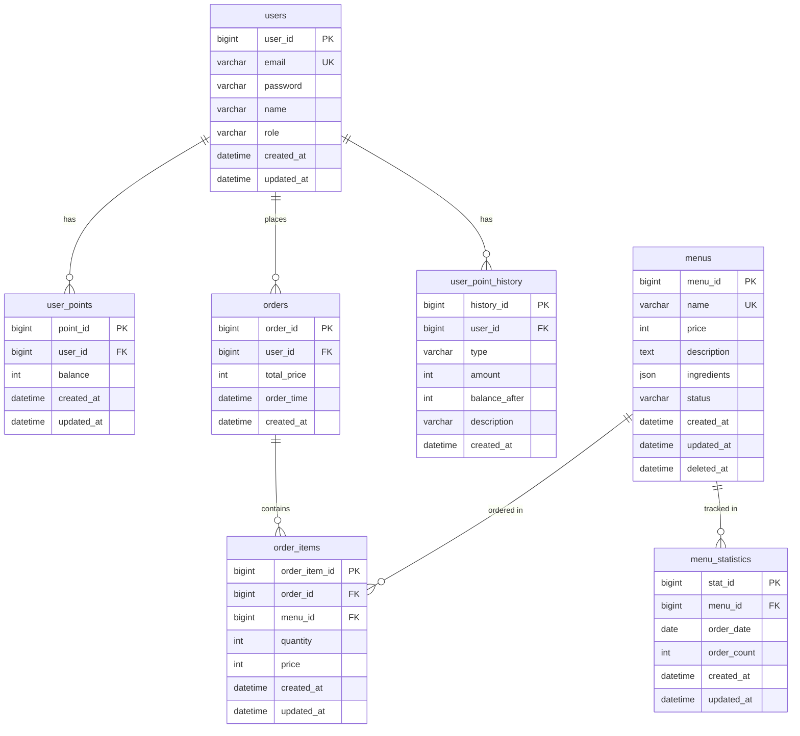

# ERD 설계서

## 1. 문서 개요

이 문서는 커피숍 주문 시스템의 데이터베이스 설계를 정의합니다.

---

## 2. ERD 다이어그램 (Mermaid)

### 2.1 전체 ERD (V1.0)



---

## 3. 테이블 상세 명세

### 3.1 users (사용자)

**설명**: 사용자 및 관리자 정보를 저장하는 테이블

| 컬럼명 | 타입 | 제약조건 | 설명 | 예시 |
|--------|------|----------|------|------|
| user_id | BIGINT | PK, AUTO_INCREMENT | 사용자 ID | 1 |
| email | VARCHAR(100) | NOT NULL, UNIQUE | 이메일 (로그인 ID) | user@example.com |
| password | VARCHAR(255) | NOT NULL | BCrypt 해시 비밀번호 | $2a$10$... |
| name | VARCHAR(50) | NOT NULL | 사용자 이름 | 홍길동 |
| role | VARCHAR(20) | NOT NULL, DEFAULT 'USER' | 역할 (USER, ADMIN) | USER |
| created_at | DATETIME | NOT NULL, DEFAULT CURRENT_TIMESTAMP | 생성 시간 | 2026-05-06 10:00:00 |
| updated_at | DATETIME | NOT NULL, DEFAULT CURRENT_TIMESTAMP ON UPDATE | 수정 시간 | 2026-05-06 10:00:00 |

**인덱스**:
- PRIMARY KEY: `user_id`
- UNIQUE KEY: `email`
- INDEX: `role` (관리자 조회 최적화)

**비즈니스 규칙**:
- 이메일 중복 불가
- 비밀번호는 BCrypt로 해싱 (strength 10)
- role은 'USER' 또는 'ADMIN'만 허용

---

### 3.2 user_points (사용자 포인트)

**설명**: 사용자별 포인트 잔액을 저장하는 테이블

| 컬럼명 | 타입 | 제약조건 | 설명 | 예시 |
|--------|------|----------|------|------|
| point_id | BIGINT | PK, AUTO_INCREMENT | 포인트 ID | 1 |
| user_id | BIGINT | FK, NOT NULL, UNIQUE | 사용자 ID | 1 |
| balance | INT | NOT NULL, DEFAULT 0, CHECK >= 0 | 포인트 잔액 | 10000 |
| created_at | DATETIME | NOT NULL, DEFAULT CURRENT_TIMESTAMP | 생성 시간 | 2026-05-06 10:00:00 |
| updated_at | DATETIME | NOT NULL, DEFAULT CURRENT_TIMESTAMP ON UPDATE | 수정 시간 | 2026-05-06 10:00:00 |

**인덱스**:
- PRIMARY KEY: `point_id`
- UNIQUE KEY: `user_id`
- FOREIGN KEY: `user_id` REFERENCES `users(user_id)` ON DELETE CASCADE

**비즈니스 규칙**:
- 사용자당 1개의 포인트 레코드만 존재
- balance는 절대 음수가 될 수 없음 (CHECK 제약조건)
- 포인트 차감 시 비관적 락 사용 (`SELECT ... FOR UPDATE`)

---

### 3.3 user_point_history (포인트 이력)

**설명**: 포인트 충전/사용 이력을 저장하는 테이블

| 컬럼명 | 타입 | 제약조건 | 설명 | 예시 |
|--------|------|----------|------|------|
| history_id | BIGINT | PK, AUTO_INCREMENT | 이력 ID | 1 |
| user_id | BIGINT | FK, NOT NULL | 사용자 ID | 1 |
| type | VARCHAR(20) | NOT NULL | 유형 (CHARGE, USE) | CHARGE |
| amount | INT | NOT NULL | 변동 금액 | 10000 |
| balance_after | INT | NOT NULL | 변동 후 잔액 | 10000 |
| description | VARCHAR(200) | NULL | 설명 | 포인트 충전 |
| created_at | DATETIME | NOT NULL, DEFAULT CURRENT_TIMESTAMP | 생성 시간 | 2026-05-06 10:00:00 |

**인덱스**:
- PRIMARY KEY: `history_id`
- INDEX: `user_id, created_at` (사용자별 이력 조회 최적화)
- FOREIGN KEY: `user_id` REFERENCES `users(user_id)` ON DELETE CASCADE

**비즈니스 규칙**:
- type은 'CHARGE' (충전) 또는 'USE' (사용)만 허용
- 모든 포인트 변동은 이력에 기록
- 이력은 삭제 불가 (감사 추적)

---

### 3.4 menus (메뉴)

**설명**: 커피 메뉴 정보를 저장하는 테이블

| 컬럼명 | 타입 | 제약조건 | 설명 | 예시 |
|--------|------|----------|------|------|
| menu_id | BIGINT | PK, AUTO_INCREMENT | 메뉴 ID | 1 |
| name | VARCHAR(50) | NOT NULL, UNIQUE | 메뉴명 | 아메리카노 |
| price | INT | NOT NULL, CHECK > 0 | 가격 (원) | 4500 |
| description | TEXT | NULL | 메뉴 설명 | 깊고 진한 에스프레소 |
| ingredients | JSON | NULL | 원자재 태그 (향후 확장 대비) | ["원두", "물"] |
| status | VARCHAR(20) | NOT NULL, DEFAULT 'AVAILABLE' | 메뉴 상태 | AVAILABLE |
| created_at | DATETIME | NOT NULL, DEFAULT CURRENT_TIMESTAMP | 생성 시간 | 2026-05-06 10:00:00 |
| updated_at | DATETIME | NOT NULL, DEFAULT CURRENT_TIMESTAMP ON UPDATE | 수정 시간 | 2026-05-06 10:00:00 |
| deleted_at | DATETIME | NULL | 삭제 시간 (논리 삭제) | NULL |

**인덱스**:
- PRIMARY KEY: `menu_id`
- UNIQUE KEY: `name` (삭제되지 않은 메뉴만)
- INDEX: `status, deleted_at` (판매중 메뉴 조회 최적화)

**비즈니스 규칙**:
- 메뉴명 중복 불가 (삭제되지 않은 메뉴 기준)
- status는 'AVAILABLE' (판매중) 또는 'SOLD_OUT' (품절)만 허용
- 삭제는 논리 삭제 (deleted_at 설정)
- ingredients는 JSON 배열 형태로 저장 (향후 테이블 분리 예정)

**ingredients JSON 예시**:
```json
["원두", "물"]
["원두", "우유", "시럽"]
```

---

### 3.5 orders (주문)

**설명**: 주문 정보를 저장하는 테이블

| 컬럼명 | 타입 | 제약조건 | 설명 | 예시 |
|--------|------|----------|------|------|
| order_id | BIGINT | PK, AUTO_INCREMENT | 주문 ID | 1 |
| user_id | BIGINT | FK, NOT NULL | 사용자 ID | 1 |
| total_price | INT | NOT NULL | 총 결제 금액 | 14000 |
| order_time | DATETIME | NOT NULL | 주문 시간 | 2026-05-06 10:30:00 |
| created_at | DATETIME | NOT NULL, DEFAULT CURRENT_TIMESTAMP | 생성 시간 | 2026-05-06 10:30:00 |

**인덱스**:
- PRIMARY KEY: `order_id`
- INDEX: `user_id, order_time` (사용자별 주문 내역 조회)
- INDEX: `order_time` (기간별 주문 조회)
- FOREIGN KEY: `user_id` REFERENCES `users(user_id)` ON DELETE CASCADE

**비즈니스 규칙**:
- total_price는 주문 시점의 총 결제 금액을 저장
- 주문 상세 정보는 order_items 테이블에 저장
- 주문은 삭제 불가 (감사 추적)

---

### 3.6 order_items (주문 상세)

**설명**: 주문별 메뉴 상세 정보를 저장하는 테이블

| 컬럼명 | 타입 | 제약조건 | 설명 | 예시 |
|--------|------|----------|------|------|
| order_item_id | BIGINT | PK, AUTO_INCREMENT | 주문 상세 ID | 1 |
| order_id | BIGINT | FK, NOT NULL | 주문 ID | 1 |
| menu_id | BIGINT | FK, NOT NULL | 메뉴 ID | 1 |
| quantity | INT | NOT NULL, CHECK > 0 | 수량 | 2 |
| price | INT | NOT NULL | 단가 (주문 시점 가격) | 4500 |
| created_at | DATETIME | NOT NULL, DEFAULT CURRENT_TIMESTAMP | 생성 시간 | 2026-05-06 10:30:00 |
| updated_at | DATETIME | NOT NULL, DEFAULT CURRENT_TIMESTAMP ON UPDATE | 수정 시간 | 2026-05-06 10:30:00 |

**인덱스**:
- PRIMARY KEY: `order_item_id`
- INDEX: `order_id` (주문별 상세 조회)
- INDEX: `menu_id` (메뉴별 주문 통계)
- FOREIGN KEY: `order_id` REFERENCES `orders(order_id)` ON DELETE CASCADE
- FOREIGN KEY: `menu_id` REFERENCES `menus(menu_id)` ON DELETE RESTRICT

**비즈니스 규칙**:
- price는 주문 시점의 메뉴 단가를 저장 (가격 변동 이력 보존)
- quantity는 1개 이상이어야 함
- menu_id는 삭제 제한 (주문 내역 보존)
- 소계 = price × quantity

---

### 3.7 menu_statistics (메뉴 통계)

**설명**: 날짜별 메뉴 주문 횟수를 저장하는 집계 테이블

| 컬럼명 | 타입 | 제약조건 | 설명 | 예시 |
|--------|------|----------|------|------|
| stat_id | BIGINT | PK, AUTO_INCREMENT | 통계 ID | 1 |
| menu_id | BIGINT | FK, NOT NULL | 메뉴 ID | 1 |
| order_date | DATE | NOT NULL | 주문 날짜 | 2026-05-06 |
| order_count | INT | NOT NULL, DEFAULT 0 | 주문 횟수 | 15 |
| created_at | DATETIME | NOT NULL, DEFAULT CURRENT_TIMESTAMP | 생성 시간 | 2026-05-06 10:00:00 |
| updated_at | DATETIME | NOT NULL, DEFAULT CURRENT_TIMESTAMP ON UPDATE | 수정 시간 | 2026-05-06 10:30:00 |

**인덱스**:
- PRIMARY KEY: `stat_id`
- UNIQUE KEY: `menu_id, order_date` (날짜별 메뉴 중복 방지)
- INDEX: `order_date` (기간별 통계 조회)
- FOREIGN KEY: `menu_id` REFERENCES `menus(menu_id)` ON DELETE CASCADE

**비즈니스 규칙**:
- 주문 생성 시 자동 업데이트 (INSERT ... ON DUPLICATE KEY UPDATE)
- 인기 메뉴 조회 시 최근 7일 데이터 집계
- 오래된 데이터는 배치로 삭제 (90일 이상)

**업데이트 쿼리**:
```sql
INSERT INTO menu_statistics (menu_id, order_date, order_count)
VALUES (?, CURDATE(), 1)
ON DUPLICATE KEY UPDATE order_count = order_count + 1;
```

---

## 4. 관계 설명

### 4.1 users ↔ user_points (1:1)
- 사용자는 1개의 포인트 계정을 가짐
- 포인트 계정은 1명의 사용자에게 속함
- CASCADE 삭제: 사용자 삭제 시 포인트도 삭제

### 4.2 users ↔ user_point_history (1:N)
- 사용자는 여러 포인트 이력을 가짐
- 포인트 이력은 1명의 사용자에게 속함
- CASCADE 삭제: 사용자 삭제 시 이력도 삭제

### 4.3 users ↔ orders (1:N)
- 사용자는 여러 주문을 할 수 있음
- 주문은 1명의 사용자에게 속함
- CASCADE 삭제: 사용자 삭제 시 주문도 삭제

### 4.4 orders ↔ order_items (1:N)
- 주문은 여러 주문 상세를 가짐
- 주문 상세는 1개의 주문에 속함
- CASCADE 삭제: 주문 삭제 시 주문 상세도 삭제

### 4.5 menus ↔ order_items (1:N)
- 메뉴는 여러 주문 상세에 포함될 수 있음
- 주문 상세는 1개의 메뉴를 참조
- RESTRICT 삭제: 주문이 있는 메뉴는 삭제 불가 (논리 삭제만 가능)

### 4.6 menus ↔ menu_statistics (1:N)
- 메뉴는 여러 날짜의 통계를 가짐
- 통계는 1개의 메뉴에 속함
- CASCADE 삭제: 메뉴 삭제 시 통계도 삭제

---

## 5. 데이터 타입 선택 근거

| 타입 | 사용처 | 선택 이유 |
|------|--------|-----------|
| BIGINT | PK, FK | 최대 9,223,372,036,854,775,807 지원, 확장성 |
| VARCHAR | 문자열 | 가변 길이, 저장 공간 효율적 |
| INT | 금액, 수량 | -2,147,483,648 ~ 2,147,483,647, 충분한 범위 |
| TEXT | 긴 설명 | 최대 65,535자, 메뉴 설명에 적합 |
| JSON | 배열 데이터 | 원자재 태그, 향후 확장 용이 |
| DATETIME | 시간 | 밀리초 단위 정확도, 타임존 고려 |
| DATE | 날짜만 | 통계 집계에 적합 |

---

## 6. 인덱스 전략

### 6.1 Primary Key
- 모든 테이블에 AUTO_INCREMENT BIGINT PK 사용
- 클러스터드 인덱스로 자동 정렬

### 6.2 Unique Key
- `users.email`: 로그인 ID 중복 방지
- `menus.name`: 메뉴명 중복 방지
- `user_points.user_id`: 사용자당 1개 포인트 계정
- `menu_statistics(menu_id, order_date)`: 날짜별 메뉴 중복 방지

### 6.3 Foreign Key Index
- 모든 FK에 자동 인덱스 생성
- JOIN 성능 최적화

### 6.4 Composite Index
- `user_point_history(user_id, created_at)`: 사용자별 이력 조회
- `orders(user_id, order_time)`: 사용자별 주문 내역
- `orders(menu_id, order_time)`: 메뉴별 주문 통계
- `menus(status, deleted_at)`: 판매중 메뉴 조회

---

## 7. 제약조건 (Constraints)

### 7.1 CHECK 제약조건
```sql
-- 포인트 잔액은 음수 불가
ALTER TABLE user_points ADD CONSTRAINT chk_balance CHECK (balance >= 0);

-- 메뉴 가격은 양수
ALTER TABLE menus ADD CONSTRAINT chk_price CHECK (price > 0);

-- 포인트 변동 금액은 0이 아님
ALTER TABLE user_point_history ADD CONSTRAINT chk_amount CHECK (amount != 0);
```

### 7.2 ENUM 제약조건 (Application Level)
```java
// users.role
public enum UserRole {
    USER, ADMIN
}

// menus.status
public enum MenuStatus {
    AVAILABLE, SOLD_OUT
}

// user_point_history.type
public enum PointHistoryType {
    CHARGE, USE
}
```

---

## 8. 샘플 데이터

### 8.1 users
```sql
INSERT INTO users (email, password, name, role) VALUES
('user1@example.com', '$2a$10$...', '홍길동', 'USER'),
('user2@example.com', '$2a$10$...', '김철수', 'USER'),
('admin@example.com', '$2a$10$...', '관리자', 'ADMIN');
```

### 8.2 menus
```sql
INSERT INTO menus (name, price, description, ingredients, status) VALUES
('아메리카노', 4500, '깊고 진한 에스프레소', '["원두", "물"]', 'AVAILABLE'),
('카페라떼', 5000, '부드러운 우유와 에스프레소', '["원두", "우유", "물"]', 'AVAILABLE'),
('바닐라라떼', 5500, '달콤한 바닐라 시럽', '["원두", "우유", "바닐라시럽", "물"]', 'AVAILABLE'),
('에스프레소', 4000, '진한 에스프레소 샷', '["원두", "물"]', 'AVAILABLE'),
('카푸치노', 5000, '우유 거품이 풍부한', '["원두", "우유", "물"]', 'AVAILABLE');
```

### 8.3 user_points
```sql
INSERT INTO user_points (user_id, balance) VALUES
(1, 10000),
(2, 5000);
```

### 8.4 orders (샘플)
```sql
INSERT INTO orders (user_id, total_price, order_time) VALUES
(1, 14000, '2026-05-06 10:30:00');
```

### 8.5 order_items (샘플)
```sql
INSERT INTO order_items (order_id, menu_id, quantity, price) VALUES
(1, 1, 2, 4500),  -- 아메리카노 2개
(1, 2, 1, 5000);  -- 카페라떼 1개
```

---

## 9. 향후 확장 계획 (V2.0)

### 9.1 추가 테이블

#### ingredients (원자재)
```sql
CREATE TABLE ingredients (
    ingredient_id BIGINT PRIMARY KEY AUTO_INCREMENT,
    name VARCHAR(50) NOT NULL UNIQUE,
    unit VARCHAR(20) NOT NULL,
    stock_quantity INT NOT NULL DEFAULT 0,
    min_quantity INT NOT NULL DEFAULT 0,
    created_at DATETIME NOT NULL DEFAULT CURRENT_TIMESTAMP,
    updated_at DATETIME NOT NULL DEFAULT CURRENT_TIMESTAMP ON UPDATE CURRENT_TIMESTAMP
);
```

#### menu_ingredients (메뉴-원자재 관계)
```sql
CREATE TABLE menu_ingredients (
    menu_ingredient_id BIGINT PRIMARY KEY AUTO_INCREMENT,
    menu_id BIGINT NOT NULL,
    ingredient_id BIGINT NOT NULL,
    required_quantity INT NOT NULL,
    created_at DATETIME NOT NULL DEFAULT CURRENT_TIMESTAMP,
    FOREIGN KEY (menu_id) REFERENCES menus(menu_id) ON DELETE CASCADE,
    FOREIGN KEY (ingredient_id) REFERENCES ingredients(ingredient_id) ON DELETE RESTRICT,
    UNIQUE KEY (menu_id, ingredient_id)
);
```

#### ingredient_history (원자재 입출고 이력)
```sql
CREATE TABLE ingredient_history (
    history_id BIGINT PRIMARY KEY AUTO_INCREMENT,
    ingredient_id BIGINT NOT NULL,
    type VARCHAR(20) NOT NULL, -- IN, OUT
    quantity INT NOT NULL,
    reason VARCHAR(100),
    admin_id BIGINT,
    created_at DATETIME NOT NULL DEFAULT CURRENT_TIMESTAMP,
    FOREIGN KEY (ingredient_id) REFERENCES ingredients(ingredient_id) ON DELETE CASCADE,
    FOREIGN KEY (admin_id) REFERENCES users(user_id) ON DELETE SET NULL,
    INDEX (ingredient_id, created_at)
);
```

### 9.2 마이그레이션 전략

**Phase 1 (V1.0 → V1.5)**:
1. `ingredients` 테이블 추가
2. `menu_ingredients` 테이블 추가
3. 기존 메뉴의 `ingredients` 컬럼 데이터를 새 테이블로 마이그레이션
4. 수동 품절 처리 유지 (기존 방식)

**Phase 2 (V1.5 → V2.0)**:
1. `ingredient_history` 테이블 추가
2. 자동 품절 처리 로직 추가
3. 원자재 입고 관리 기능 추가
4. 관리자 대시보드에 재고 현황 표시

**마이그레이션 쿼리 예시**:

```sql
-- Step 1: ingredients 테이블에 고유한 재료 추출
INSERT INTO ingredients (name, unit, stock_quantity, min_quantity)
SELECT DISTINCT 
    ingredient_name,
    'g' as unit,
    1000 as stock_quantity,
    100 as min_quantity
FROM (
    SELECT JSON_UNQUOTE(JSON_EXTRACT(ingredients, CONCAT('$[', numbers.n, ']'))) as ingredient_name
    FROM menus
    CROSS JOIN (
        SELECT 0 as n UNION ALL SELECT 1 UNION ALL SELECT 2 
        UNION ALL SELECT 3 UNION ALL SELECT 4
    ) numbers
    WHERE JSON_LENGTH(ingredients) > numbers.n
      AND deleted_at IS NULL
) AS extracted_ingredients
WHERE ingredient_name IS NOT NULL;

-- Step 2: menu_ingredients 관계 테이블 생성
INSERT INTO menu_ingredients (menu_id, ingredient_id, required_quantity)
SELECT 
    m.menu_id,
    i.ingredient_id,
    20 as required_quantity  -- 기본값 (실제로는 재료별로 다름)
FROM menus m
CROSS JOIN ingredients i
WHERE JSON_CONTAINS(m.ingredients, JSON_QUOTE(i.name))
  AND m.deleted_at IS NULL;

-- Step 3: 검증 쿼리
SELECT 
    m.name as menu_name,
    GROUP_CONCAT(i.name) as ingredients
FROM menus m
JOIN menu_ingredients mi ON m.menu_id = mi.menu_id
JOIN ingredients i ON mi.ingredient_id = i.ingredient_id
WHERE m.deleted_at IS NULL
GROUP BY m.menu_id, m.name;

-- Step 4: 충분한 검증 후 기존 컬럼 제거
-- ALTER TABLE menus DROP COLUMN ingredients;


---

## 10. 성능 최적화 전략

### 10.1 쿼리 최적화

**인기 메뉴 조회 (Redis 캐싱)**:
```sql
-- 캐시 미스 시 실행
SELECT 
    m.menu_id,
    m.name,
    m.price,
    SUM(ms.order_count) as total_count
FROM menus m
JOIN menu_statistics ms ON m.menu_id = ms.menu_id
WHERE ms.order_date >= CURDATE() - INTERVAL 7 DAY
  AND m.status = 'AVAILABLE'
  AND m.deleted_at IS NULL
GROUP BY m.menu_id, m.name, m.price
ORDER BY total_count DESC
LIMIT 3;
```

**사용자 주문 내역 조회**:
```sql
SELECT 
    o.order_id,
    o.total_price,
    o.order_time,
    oi.menu_id,
    m.name as menu_name,
    oi.quantity,
    oi.price,
    (oi.quantity * oi.price) as subtotal
FROM orders o
JOIN order_items oi ON o.order_id = oi.order_id
JOIN menus m ON oi.menu_id = m.menu_id
WHERE o.user_id = ?
  AND o.order_time >= CURDATE() - INTERVAL 30 DAY
ORDER BY o.order_time DESC, oi.order_item_id
LIMIT 100;
```

### 10.2 파티셔닝 (향후 확장)

**orders 테이블 월별 파티셔닝**:
```sql
ALTER TABLE orders
PARTITION BY RANGE (YEAR(order_time) * 100 + MONTH(order_time)) (
    PARTITION p202605 VALUES LESS THAN (202606),
    PARTITION p202606 VALUES LESS THAN (202607),
    PARTITION p202607 VALUES LESS THAN (202608),
    PARTITION pmax VALUES LESS THAN MAXVALUE
);
```

**order_items 테이블 월별 파티셔닝** (orders와 동일):
```sql
ALTER TABLE order_items
PARTITION BY RANGE (YEAR(created_at) * 100 + MONTH(created_at)) (
    PARTITION p202605 VALUES LESS THAN (202606),
    PARTITION p202606 VALUES LESS THAN (202607),
    PARTITION p202607 VALUES LESS THAN (202608),
    PARTITION pmax VALUES LESS THAN MAXVALUE
);
```

### 10.3 인덱스 힌트

**포인트 조회 시 비관적 락**:
```sql
SELECT * FROM user_points 
WHERE user_id = ? 
FOR UPDATE;
```

---

## 11. 백업 및 복구 전략

### 11.1 백업 주기
- **전체 백업**: 매일 새벽 2시
- **증분 백업**: 6시간마다
- **트랜잭션 로그**: 실시간

### 11.2 보관 기간
- 최근 7일: 전체 백업 보관
- 최근 30일: 주간 백업 보관
- 1년: 월간 백업 보관

### 11.3 복구 시나리오
1. 데이터 손실 시: 최근 전체 백업 + 트랜잭션 로그 복구
2. 테이블 손상 시: 해당 테이블만 복구
3. 전체 장애 시: 최근 백업으로 새 인스턴스 생성

---

## 12. 다음 단계

1. ✅ 프로젝트 개요서 작성 완료
2. ✅ 사용자 시나리오 (페르소나 포함) 작성 완료
3. ✅ 유스케이스 명세서 작성 완료
4. ✅ 기능 명세서 작성 완료
5. ✅ **ERD 설계서** 작성 완료
6. ⏭️ API 명세서
7. ⏭️ 화면 설계서
8. ⏭️ 인프라 아키텍처 다이어그램
9. ⏭️ 동시성 제어 설계서 ⭐
10. ⏭️ ADR (Architecture Decision Record)

---

## 문서 이력

| 버전 | 작성일 | 작성자 | 변경 내역 |
|------|--------|--------|-----------|
| 1.0 | 2026-05-06 | Kiro | 초안 작성, V1.0 ERD + V2.0 확장 계획 |
| 1.1 | 2026-05-08 | Kiro | orders, order_items 테이블 업데이트: 다중 항목 주문 시스템 반영 |
