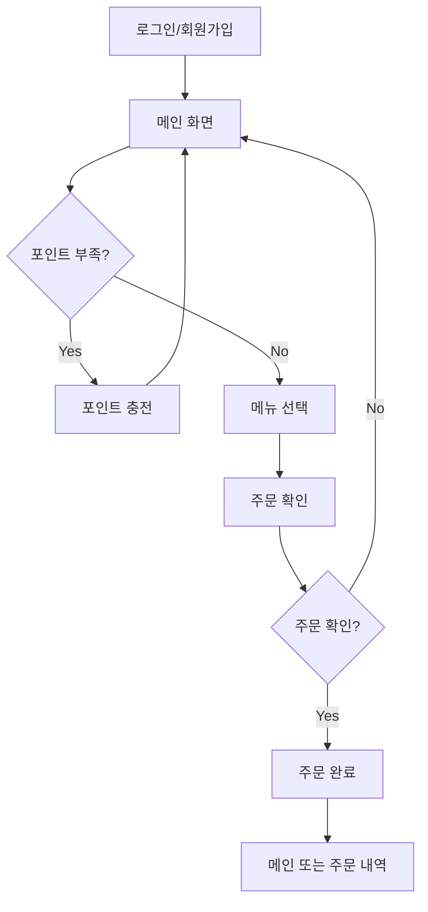
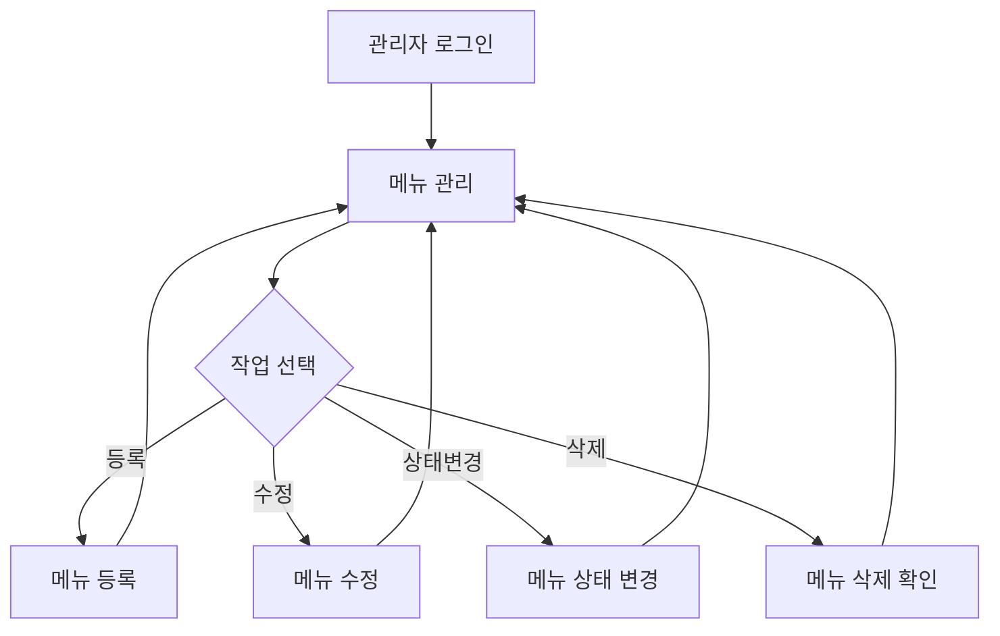

# 화면 설계서

## 1. 문서 개요

이 문서는 커피숍 주문 시스템의 화면 설계 및 와이어프레임을 정의합니다.

**참고**: 프론트엔드는 바이브코딩으로 간단히 구현하며, 본 문서는 화면 구조와 주요 기능 배치를 정의합니다.

---

## 2. 화면 구조

### 2.1 사용자 화면 (User)
1. 로그인/회원가입
2. 메인 (메뉴 목록 + 인기 메뉴)
3. 포인트 충전
4. 주문 확인
5. 주문 내역

### 2.2 관리자 화면 (Admin)
1. 관리자 로그인
2. 메뉴 관리 (목록/등록/수정/삭제)
3. 메뉴 상태 관리

---

## 3. 사용자 화면 상세

### 3.1 로그인/회원가입 화면

**화면 ID**: US-01

**와이어프레임**:
```
┌─────────────────────────────────────┐
│         커피숍 주문 시스템            │
├─────────────────────────────────────┤
│                                     │
│   [로그인] [회원가입] ← 탭           │
│                                     │
│   이메일                             │
│   [____________________________]    │
│                                     │
│   비밀번호                           │
│   [____________________________]    │
│                                     │
│   (회원가입 시)                      │
│   이름                               │
│   [____________________________]    │
│                                     │
│         [로그인/가입하기]            │
│                                     │
└─────────────────────────────────────┘
```

**주요 기능**:
- 이메일/비밀번호 입력
- 회원가입 시 이름 추가 입력
- 유효성 검증 (이메일 형식, 비밀번호 8자 이상)
- 로그인 성공 시 메인 화면으로 이동

---

### 3.2 메인 화면 (메뉴 목록)

**화면 ID**: US-02

**와이어프레임**:
```
┌─────────────────────────────────────┐
│  ☰  커피숍 주문 시스템    [포인트: 10,000P] │
├─────────────────────────────────────┤
│                                     │
│  🔥 인기 메뉴 TOP 3                  │
│  ┌───────┬───────┬───────┐          │
│  │ 1위   │ 2위   │ 3위   │          │
│  │아메리카노│카페라떼│바닐라라떼│          │
│  │4,500원│5,000원│5,500원│          │
│  │[주문] │[주문] │[주문] │          │
│  └───────┴───────┴───────┘          │
│                                     │
│  📋 전체 메뉴                        │
│  ┌─────────────────────────────┐   │
│  │ 아메리카노          4,500원  │   │
│  │ 깊고 진한 에스프레소          │   │
│  │                    [주문하기] │   │
│  ├─────────────────────────────┤   │
│  │ 카페라떼            5,000원  │   │
│  │ 부드러운 우유와 에스프레소    │   │
│  │                    [주문하기] │   │
│  ├─────────────────────────────┤   │
│  │ 바닐라라떼          5,500원  │   │
│  │ 달콤한 바닐라 시럽            │   │
│  │                    [주문하기] │   │
│  └─────────────────────────────┘   │
│                                     │
│  [포인트 충전]  [주문 내역]          │
└─────────────────────────────────────┘
```

**주요 기능**:
- 상단: 현재 포인트 잔액 표시
- 인기 메뉴 3개 카드 형태로 표시
- 전체 메뉴 목록 (판매중인 메뉴만)
- 각 메뉴별 주문하기 버튼
- 하단: 포인트 충전, 주문 내역 버튼

---

### 3.3 포인트 충전 화면

**화면 ID**: US-03

**와이어프레임**:
```
┌─────────────────────────────────────┐
│  ← 포인트 충전                       │
├─────────────────────────────────────┤
│                                     │
│  현재 포인트: 10,000P                │
│                                     │
│  충전 금액 선택                      │
│  ┌─────────────────────────────┐   │
│  │  [  5,000원  ]              │   │
│  │  [ 10,000원  ]              │   │
│  │  [ 30,000원  ]              │   │
│  │  [ 50,000원  ]              │   │
│  └─────────────────────────────┘   │
│                                     │
│  또는 직접 입력                      │
│  [____________________________]    │
│                                     │
│         [충전하기]                   │
│                                     │
└─────────────────────────────────────┘
```

**주요 기능**:
- 현재 포인트 잔액 표시
- 금액 선택 버튼 (5천/1만/3만/5만)
- 직접 입력 가능
- 충전 성공 시 메인 화면으로 이동

---

### 3.4 주문 확인 화면

**화면 ID**: US-04

**와이어프레임**:
```
┌─────────────────────────────────────┐
│  주문 확인                           │
├─────────────────────────────────────┤
│                                     │
│  주문 메뉴                           │
│  ┌─────────────────────────────┐   │
│  │  아메리카노                  │   │
│  │  4,500원                     │   │
│  └─────────────────────────────┘   │
│                                     │
│  결제 정보                           │
│  ┌─────────────────────────────┐   │
│  │  현재 포인트: 10,000P        │   │
│  │  결제 금액:    4,500P        │   │
│  │  ─────────────────────       │   │
│  │  잔여 포인트:  5,500P        │   │
│  └─────────────────────────────┘   │
│                                     │
│    [취소]        [주문하기]          │
│                                     │
└─────────────────────────────────────┘
```

**주요 기능**:
- 주문 메뉴 정보 표시
- 결제 금액 및 잔여 포인트 계산
- 주문 확인/취소
- 주문 성공 시 주문 완료 화면으로 이동

---

### 3.5 주문 완료 화면

**화면 ID**: US-05

**와이어프레임**:
```
┌─────────────────────────────────────┐
│  주문 완료                           │
├─────────────────────────────────────┤
│                                     │
│         ✅                           │
│    주문이 완료되었습니다!            │
│                                     │
│  주문 번호: #123                     │
│  메뉴: 아메리카노                    │
│  결제 금액: 4,500P                   │
│  주문 시간: 2026-05-06 10:30         │
│                                     │
│  잔여 포인트: 5,500P                 │
│                                     │
│    [메인으로]    [주문 내역]         │
│                                     │
└─────────────────────────────────────┘
```

**주요 기능**:
- 주문 완료 메시지
- 주문 번호, 메뉴, 금액, 시간 표시
- 잔여 포인트 표시
- 메인 또는 주문 내역으로 이동

---

### 3.6 주문 내역 화면

**화면 ID**: US-06

**와이어프레임**:
```
┌─────────────────────────────────────┐
│  ← 주문 내역                         │
├─────────────────────────────────────┤
│                                     │
│  최근 30일 주문 내역                 │
│                                     │
│  ┌─────────────────────────────┐   │
│  │ #123  아메리카노    4,500원  │   │
│  │ 2026-05-06 10:30             │   │
│  ├─────────────────────────────┤   │
│  │ #122  카페라떼      5,000원  │   │
│  │ 2026-05-05 14:20             │   │
│  ├─────────────────────────────┤   │
│  │ #121  바닐라라떼    5,500원  │   │
│  │ 2026-05-04 09:15             │   │
│  └─────────────────────────────┘   │
│                                     │
│  (주문 내역이 없습니다)              │
│                                     │
└─────────────────────────────────────┘
```

**주요 기능**:
- 최근 30일 주문 내역 표시
- 주문 번호, 메뉴명, 금액, 시간
- 내역 없을 시 안내 메시지

---

## 4. 관리자 화면 상세

### 4.1 관리자 로그인 화면

**화면 ID**: AD-01

**와이어프레임**:
```
┌─────────────────────────────────────┐
│      관리자 로그인                   │
├─────────────────────────────────────┤
│                                     │
│   🔐 관리자 전용                     │
│                                     │
│   이메일                             │
│   [____________________________]    │
│                                     │
│   비밀번호                           │
│   [____________________________]    │
│                                     │
│         [로그인]                     │
│                                     │
└─────────────────────────────────────┘
```

**주요 기능**:
- 관리자 이메일/비밀번호 입력
- 관리자 권한 검증
- 로그인 성공 시 메뉴 관리 화면으로 이동

---

### 4.2 메뉴 관리 화면

**화면 ID**: AD-02

**와이어프레임**:
```
┌─────────────────────────────────────┐
│  ☰ 관리자 페이지        [로그아웃]   │
├─────────────────────────────────────┤
│                                     │
│  메뉴 관리              [+ 메뉴 등록]│
│                                     │
│  ┌─────────────────────────────┐   │
│  │ ID  메뉴명      가격   상태  │   │
│  ├─────────────────────────────┤   │
│  │ 1  아메리카노  4,500  🟢판매중│   │
│  │    [수정] [상태변경] [삭제]  │   │
│  ├─────────────────────────────┤   │
│  │ 2  카페라떼    5,000  🟢판매중│   │
│  │    [수정] [상태변경] [삭제]  │   │
│  ├─────────────────────────────┤   │
│  │ 3  에스프레소  4,000  🔴품절  │   │
│  │    [수정] [상태변경] [삭제]  │   │
│  └─────────────────────────────┘   │
│                                     │
└─────────────────────────────────────┘
```

**주요 기능**:
- 전체 메뉴 목록 (판매중/품절 모두 표시)
- 메뉴 등록 버튼
- 각 메뉴별 수정/상태변경/삭제 버튼
- 상태 아이콘 (🟢 판매중, 🔴 품절)

---

### 4.3 메뉴 등록/수정 화면

**화면 ID**: AD-03

**와이어프레임**:
```
┌─────────────────────────────────────┐
│  ← 메뉴 등록                         │
├─────────────────────────────────────┤
│                                     │
│  메뉴명 *                            │
│  [____________________________]    │
│                                     │
│  가격 (원) *                         │
│  [____________________________]    │
│                                     │
│  설명                                │
│  [____________________________]    │
│  [____________________________]    │
│                                     │
│  원자재 태그                         │
│  [원두] [우유] [시럽] [물]           │
│  선택: 원두, 물                      │
│                                     │
│    [취소]        [등록하기]          │
│                                     │
└─────────────────────────────────────┘
```

**주요 기능**:
- 메뉴명, 가격, 설명 입력
- 원자재 태그 선택 (체크박스)
- 유효성 검증 (메뉴명 중복, 가격 범위)
- 등록/수정 완료 시 메뉴 관리 화면으로 이동

---

### 4.4 메뉴 상태 변경 화면

**화면 ID**: AD-04

**와이어프레임**:
```
┌─────────────────────────────────────┐
│  메뉴 상태 변경                      │
├─────────────────────────────────────┤
│                                     │
│  메뉴: 아메리카노                    │
│  현재 상태: 🟢 판매중                │
│                                     │
│  변경할 상태 선택                    │
│  ○ 판매중 (AVAILABLE)               │
│  ● 품절 (SOLD_OUT)                  │
│                                     │
│  사유 (선택)                         │
│  [____________________________]    │
│  예: 원두 소진                       │
│                                     │
│    [취소]        [변경하기]          │
│                                     │
└─────────────────────────────────────┘
```

**주요 기능**:
- 현재 상태 표시
- 변경할 상태 선택 (라디오 버튼)
- 사유 입력 (선택)
- 변경 완료 시 메뉴 관리 화면으로 이동

---

## 5. 화면 흐름도 (User Flow)

### 5.1 사용자 주문 플로우



### 5.2 관리자 메뉴 관리 플로우



---

## 6. 반응형 디자인 가이드

### 6.1 모바일 (< 768px)
- 단일 컬럼 레이아웃
- 인기 메뉴 세로 스크롤
- 버튼 크기 확대 (최소 44px)

### 6.2 태블릿 (768px ~ 1024px)
- 2컬럼 레이아웃
- 인기 메뉴 가로 배치

### 6.3 데스크톱 (> 1024px)
- 3컬럼 레이아웃
- 사이드바 네비게이션

---

## 7. UI 컴포넌트 라이브러리

**추천**: 바이브코딩 시 사용할 라이브러리
- **Bootstrap 5**: 빠른 프로토타이핑
- **Tailwind CSS**: 유틸리티 우선 스타일링
- **Material-UI**: 구글 디자인 시스템

---

## 8. 색상 팔레트

| 용도 | 색상 | Hex Code |
|------|------|----------|
| Primary | 브라운 | #6F4E37 |
| Secondary | 베이지 | #F5E6D3 |
| Success | 그린 | #28A745 |
| Danger | 레드 | #DC3545 |
| Warning | 옐로우 | #FFC107 |
| Info | 블루 | #17A2B8 |
| Text | 다크그레이 | #333333 |
| Background | 화이트 | #FFFFFF |

---

## 9. 타이포그래피

| 요소 | 폰트 | 크기 | 굵기 |
|------|------|------|------|
| H1 | Noto Sans KR | 32px | Bold |
| H2 | Noto Sans KR | 24px | Bold |
| H3 | Noto Sans KR | 20px | Medium |
| Body | Noto Sans KR | 16px | Regular |
| Caption | Noto Sans KR | 14px | Regular |
| Button | Noto Sans KR | 16px | Medium |

---

## 10. Figma 목업

**V1.0 범위**: 
- 본 문서의 와이어프레임으로 바이브코딩 구현
- ASCII 아트 기반 화면 구조 정의

**V2.0 확장 (선택)**:
- Figma로 상세 디자인 제작
- 컴포넌트 라이브러리 구축
- 인터랙션 프로토타입

**참고**: 1주 프로젝트에서는 Figma 목업 생략하고 와이어프레임 기반으로 직접 구현합니다.

---

## 11. 다음 단계

1. ✅ 프로젝트 개요서
2. ✅ 사용자 시나리오
3. ✅ 유스케이스 명세서
4. ✅ 기능 명세서
5. ✅ ERD 설계서
6. ✅ API 명세서
7. ✅ **화면 설계서**
8. ⏭️ 인프라 아키텍처 다이어그램
9. ⏭️ 동시성 제어 설계서
10. ⏭️ ADR

---

## 문서 이력

| 버전 | 작성일 | 작성자 | 변경 내역 |
|------|--------|--------|-----------|
| 1.0 | 2026-05-06 | Kiro | 초안 작성 |
