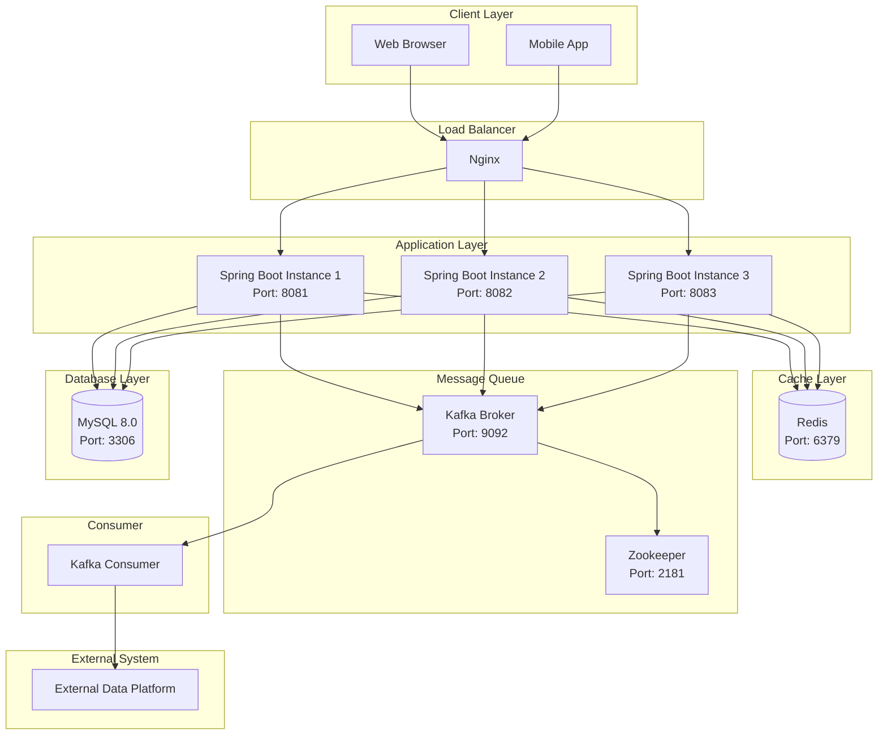

# 인프라 아키텍처 다이어그램

## 1. 문서 개요

이 문서는 커피숍 주문 시스템의 인프라 아키텍처를 정의합니다.

**배포 환경**: Docker Compose 기반 로컬 다중 인스턴스 환경

---

## 2. 전체 아키텍처 다이어그램



---

## 3. 계층별 상세 설명

### 3.1 Client Layer (클라이언트 계층)

**구성 요소**:
- Web Browser (Chrome, Safari, Firefox)
- Mobile App (향후 확장)

**역할**:
- 사용자 인터페이스 제공
- API 호출
- JWT 토큰 관리

---

### 3.2 Load Balancer (로드 밸런서)

**기술**: Nginx 1.24

**설정**:
```nginx
upstream backend {
    least_conn;  # 최소 연결 알고리즘
    server app1:8081;
    server app2:8082;
    server app3:8083;
}

server {
    listen 80;
    server_name localhost;

    location /api/ {
        proxy_pass http://backend;
        proxy_set_header Host $host;
        proxy_set_header X-Real-IP $remote_addr;
        proxy_set_header X-Forwarded-For $proxy_add_x_forwarded_for;
    }
}
```

**역할**:
- 트래픽 분산 (Round Robin / Least Connection)
- Health Check
- SSL Termination (향후 확장)

**Health Check**:
```nginx
location /health {
    access_log off;
    return 200 "healthy\n";
}
```

---

### 3.3 Application Layer (애플리케이션 계층)

**기술**: Spring Boot 3.x + Java 17

**인스턴스 구성**:
| 인스턴스 | 포트 | 역할 |
|----------|------|------|
| Instance 1 | 8081 | 주문 처리 |
| Instance 2 | 8082 | 주문 처리 |
| Instance 3 | 8083 | 주문 처리 |

**환경 변수**:
```yaml
spring:
  datasource:
    url: jdbc:mysql://mysql:3306/coffee_order
    username: ${DB_USERNAME}
    password: ${DB_PASSWORD}
  redis:
    host: redis
    port: 6379
  kafka:
    bootstrap-servers: kafka:9092
```

**JVM 옵션**:
```bash
-Xms512m -Xmx1024m
-XX:+UseG1GC
-XX:MaxGCPauseMillis=200
```

---

### 3.4 Cache Layer (캐시 계층)

**기술**: Redis 7.x

**용도**:
1. **분산 락**: 포인트 차감 동시성 제어
2. **Refresh Token 저장**: 사용자 인증
3. **인기 메뉴 캐싱**: 조회 성능 최적화

**Redis 설정**:
```conf
# redis.conf
maxmemory 256mb
maxmemory-policy allkeys-lru
appendonly yes
appendfsync everysec
```

**캐시 키 전략**:
| 키 패턴 | 용도 | TTL |
|---------|------|-----|
| `lock:user:{userId}:point` | 분산 락 | 3초 |
| `refresh_token:{userId}` | Refresh Token | 7일 |
| `popular_menus` | 인기 메뉴 | 5분 |

---

### 3.5 Message Queue (메시지 큐)

**기술**: Apache Kafka 3.x + Zookeeper

**토픽 구성**:
| 토픽명 | 파티션 | 복제 | 용도 |
|--------|--------|------|------|
| `order-events` | 3 | 1 | 주문 이벤트 |
| `order-events-dlq` | 1 | 1 | Dead Letter Queue |

**Kafka 설정**:
```properties
# server.properties
num.partitions=3
default.replication.factor=1
log.retention.hours=168  # 7일
```

**Producer 설정**:
```yaml
spring:
  kafka:
    producer:
      acks: all
      retries: 3
      key-serializer: org.apache.kafka.common.serialization.StringSerializer
      value-serializer: org.springframework.kafka.support.serializer.JsonSerializer
```

**Consumer 설정**:
```yaml
spring:
  kafka:
    consumer:
      group-id: order-consumer-group
      auto-offset-reset: earliest
      enable-auto-commit: false
      key-deserializer: org.apache.kafka.common.serialization.StringDeserializer
      value-deserializer: org.springframework.kafka.support.serializer.JsonDeserializer
```

---

### 3.6 Database Layer (데이터베이스 계층)

**기술**: MySQL 8.0

**설정**:
```cnf
# my.cnf
[mysqld]
max_connections=200
innodb_buffer_pool_size=512M
innodb_log_file_size=128M
innodb_flush_log_at_trx_commit=1
transaction-isolation=READ-COMMITTED
```

**Connection Pool (HikariCP)**:
```yaml
spring:
  datasource:
    hikari:
      maximum-pool-size: 20
      minimum-idle: 5
      connection-timeout: 30000
      idle-timeout: 600000
      max-lifetime: 1800000
```

**백업 전략**:
- 전체 백업: 매일 새벽 2시
- 증분 백업: 6시간마다
- 바이너리 로그: 실시간

---

### 3.7 Consumer (Kafka Consumer)

**기술**: Spring Boot Application (별도 프로세스)

**역할**:
- Kafka 이벤트 소비
- 외부 API 호출
- 재시도 및 DLQ 처리

**재시도 전략**:
```java
@RetryableTopic(
    attempts = "3",
    backoff = @Backoff(delay = 2000, multiplier = 2),
    dltTopicSuffix = "-dlq"
)
```

---

## 4. Docker Compose 구성

### 4.1 docker-compose.yml

```yaml
version: '3.8'

services:
  # Nginx Load Balancer
  nginx:
    image: nginx:1.24
    ports:
      - "80:80"
    volumes:
      - ./nginx.conf:/etc/nginx/nginx.conf
    depends_on:
      - app1
      - app2
      - app3

  # Spring Boot Applications
  app1:
    build: .
    ports:
      - "8081:8080"
    environment:
      - SPRING_PROFILES_ACTIVE=prod
      - DB_USERNAME=root
      - DB_PASSWORD=password
    depends_on:
      - mysql
      - redis
      - kafka

  app2:
    build: .
    ports:
      - "8082:8080"
    environment:
      - SPRING_PROFILES_ACTIVE=prod
      - DB_USERNAME=root
      - DB_PASSWORD=password
    depends_on:
      - mysql
      - redis
      - kafka

  app3:
    build: .
    ports:
      - "8083:8080"
    environment:
      - SPRING_PROFILES_ACTIVE=prod
      - DB_USERNAME=root
      - DB_PASSWORD=password
    depends_on:
      - mysql
      - redis
      - kafka

  # MySQL Database
  mysql:
    image: mysql:8.0
    ports:
      - "3306:3306"
    environment:
      - MYSQL_ROOT_PASSWORD=password
      - MYSQL_DATABASE=coffee_order
    volumes:
      - mysql_data:/var/lib/mysql
      - ./init.sql:/docker-entrypoint-initdb.d/init.sql

  # Redis Cache
  redis:
    image: redis:7-alpine
    ports:
      - "6379:6379"
    volumes:
      - redis_data:/data

  # Zookeeper
  zookeeper:
    image: confluentinc/cp-zookeeper:7.4.0
    environment:
      ZOOKEEPER_CLIENT_PORT: 2181
      ZOOKEEPER_TICK_TIME: 2000

  # Kafka Broker
  kafka:
    image: confluentinc/cp-kafka:7.4.0
    ports:
      - "9092:9092"
    environment:
      KAFKA_BROKER_ID: 1
      KAFKA_ZOOKEEPER_CONNECT: zookeeper:2181
      KAFKA_ADVERTISED_LISTENERS: PLAINTEXT://kafka:9092
      KAFKA_OFFSETS_TOPIC_REPLICATION_FACTOR: 1
    depends_on:
      - zookeeper

  # Kafka Consumer
  consumer:
    build: ./consumer
    environment:
      - SPRING_PROFILES_ACTIVE=prod
      - KAFKA_BOOTSTRAP_SERVERS=kafka:9092
    depends_on:
      - kafka

volumes:
  mysql_data:
  redis_data:
```

---

## 5. 네트워크 구성

### 5.1 포트 매핑

| 서비스 | 내부 포트 | 외부 포트 | 프로토콜 |
|--------|-----------|-----------|----------|
| Nginx | 80 | 80 | HTTP |
| App 1 | 8080 | 8081 | HTTP |
| App 2 | 8080 | 8082 | HTTP |
| App 3 | 8080 | 8083 | HTTP |
| MySQL | 3306 | 3306 | TCP |
| Redis | 6379 | 6379 | TCP |
| Kafka | 9092 | 9092 | TCP |
| Zookeeper | 2181 | 2181 | TCP |

### 5.2 네트워크 다이어그램

```
┌─────────────────────────────────────────┐
│  Host Machine (localhost)               │
│                                         │
│  ┌───────────────────────────────────┐ │
│  │  Docker Network (bridge)          │ │
│  │                                   │ │
│  │  nginx:80 ←→ app1:8080           │ │
│  │           ←→ app2:8080           │ │
│  │           ←→ app3:8080           │ │
│  │                                   │ │
│  │  app* ←→ mysql:3306              │ │
│  │       ←→ redis:6379              │ │
│  │       ←→ kafka:9092              │ │
│  │                                   │ │
│  │  kafka ←→ zookeeper:2181         │ │
│  │                                   │ │
│  │  consumer ←→ kafka:9092          │ │
│  └───────────────────────────────────┘ │
└─────────────────────────────────────────┘
```

---

## 6. 확장성 전략

### 6.1 수평 확장 (Horizontal Scaling)

**Application Layer**:
```bash
# 인스턴스 추가
docker-compose up -d --scale app=5
```

**Kafka Partitions**:
```bash
# 파티션 증가
kafka-topics --alter --topic order-events --partitions 6
```

### 6.2 수직 확장 (Vertical Scaling)

**리소스 제한 설정**:
```yaml
services:
  app1:
    deploy:
      resources:
        limits:
          cpus: '1.0'
          memory: 1024M
        reservations:
          cpus: '0.5'
          memory: 512M
```

---

## 7. 모니터링 및 로깅

### 7.1 모니터링 (향후 확장)

**도구**:
- Prometheus: 메트릭 수집
- Grafana: 대시보드
- Spring Boot Actuator: 애플리케이션 메트릭

**주요 메트릭**:
- CPU/Memory 사용률
- API 응답 시간
- 에러율
- Kafka Lag
- Redis Hit Rate

### 7.2 로깅

**로그 레벨**:
```yaml
logging:
  level:
    root: INFO
    com.example.coffeeorder: DEBUG
    org.springframework.kafka: INFO
```

**로그 파일**:
```yaml
logging:
  file:
    name: /var/log/coffee-order/application.log
    max-size: 10MB
    max-history: 30
```

---

## 8. 보안 설정

### 8.1 네트워크 보안

**방화벽 규칙**:
```bash
# 외부 접근 허용
80/tcp (HTTP)

# 내부 통신만 허용
3306/tcp (MySQL)
6379/tcp (Redis)
9092/tcp (Kafka)
```

### 8.2 환경 변수 관리

**.env 파일**:
```env
DB_USERNAME=root
DB_PASSWORD=secure_password_here
JWT_SECRET=your_jwt_secret_256bit_key
REDIS_PASSWORD=redis_password_here
```

**주의사항**:
- `.env` 파일은 `.gitignore`에 추가
- 프로덕션 환경에서는 Secret Manager 사용

---

## 9. 배포 프로세스

### 9.1 초기 배포

```bash
# 1. 이미지 빌드
docker-compose build

# 2. 컨테이너 시작
docker-compose up -d

# 3. 헬스 체크
curl http://localhost/health

# 4. 로그 확인
docker-compose logs -f app1
```

### 9.2 무중단 배포 (Rolling Update)

```bash
# 1. 인스턴스 1 업데이트
docker-compose stop app1
docker-compose build app1
docker-compose up -d app1

# 2. 헬스 체크
curl http://localhost:8081/actuator/health

# 3. 인스턴스 2, 3 순차 업데이트
# (동일 과정 반복)
```

---

## 10. 장애 복구 시나리오

### 10.1 Application 장애

**증상**: 특정 인스턴스 응답 없음

**복구**:
```bash
# 1. 문제 인스턴스 확인
docker-compose ps

# 2. 재시작
docker-compose restart app1

# 3. 로그 확인
docker-compose logs app1
```

### 10.2 Database 장애

**증상**: MySQL 연결 실패

**복구**:
```bash
# 1. MySQL 재시작
docker-compose restart mysql

# 2. 백업에서 복구 (필요 시)
docker exec -i mysql mysql -uroot -ppassword coffee_order < backup.sql
```

### 10.3 Redis 장애

**증상**: 분산 락 실패

**복구**:
```bash
# 1. Redis 재시작
docker-compose restart redis

# 2. 데이터 확인
docker exec -it redis redis-cli PING
```

### 10.4 Kafka 장애

**증상**: 이벤트 발행 실패

**복구**:
```bash
# 1. Kafka 재시작
docker-compose restart kafka zookeeper

# 2. 토픽 확인
docker exec -it kafka kafka-topics --list --bootstrap-server localhost:9092
```

---

## 11. 성능 튜닝

### 11.1 Application

- Connection Pool 크기 조정
- JVM 힙 메모리 최적화
- 비동기 처리 활용

### 11.2 Database

- 인덱스 최적화
- 쿼리 튜닝
- Buffer Pool 크기 조정

### 11.3 Redis

- 메모리 정책 설정
- 파이프라이닝 활용
- 캐시 TTL 최적화

### 11.4 Kafka

- 파티션 수 증가
- Batch Size 조정
- Compression 활성화

---

## 12. 다음 단계

1. ✅ 프로젝트 개요서
2. ✅ 사용자 시나리오
3. ✅ 유스케이스 명세서
4. ✅ 기능 명세서
5. ✅ ERD 설계서
6. ✅ API 명세서
7. ✅ 화면 설계서
8. ✅ **인프라 아키텍처 다이어그램**
9. ⏭️ 동시성 제어 설계서
10. ⏭️ ADR

---

## 문서 이력

| 버전 | 작성일 | 작성자 | 변경 내역 |
|------|--------|--------|-----------|
| 1.0 | 2026-05-06 | Kiro | 초안 작성 |
