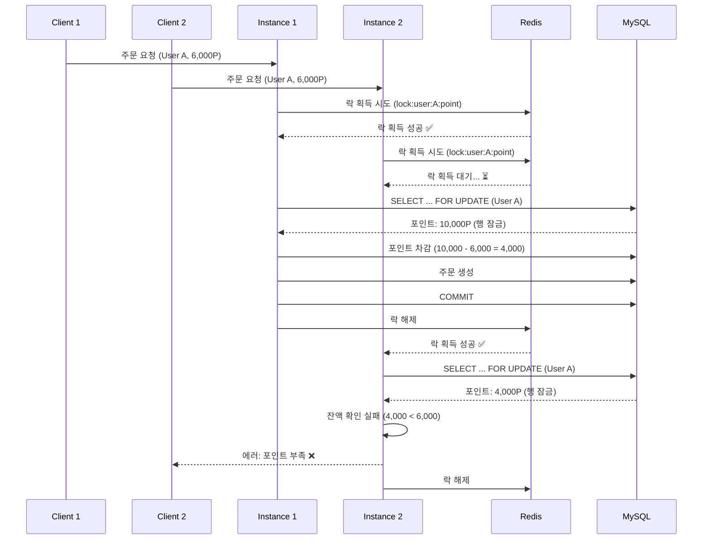

# 동시성 제어 설계서

## 1. 문서 개요

이 문서는 커피숍 주문 시스템의 동시성 제어 전략을 정의합니다.

**핵심 목표**: 다중 인스턴스 환경에서 포인트 잔액이 절대 마이너스가 되지 않도록 보장

---

## 2. 동시성 문제 시나리오

### 2.1 문제 상황

**시나리오**: 사용자 A가 10,000P를 보유하고 있고, 동시에 2개의 주문 요청이 발생

```
시간  Instance 1              Instance 2
─────────────────────────────────────────
T1    포인트 조회: 10,000P    포인트 조회: 10,000P
T2    주문 금액: 6,000P       주문 금액: 6,000P
T3    잔액 확인: OK           잔액 확인: OK
T4    포인트 차감: 4,000P     포인트 차감: 4,000P
T5    커밋                    커밋
─────────────────────────────────────────
결과  최종 잔액: 4,000P (❌ 잘못됨)
      정상 잔액: -2,000P 또는 4,000P (하나만 성공)
```

**문제점**:
- Race Condition 발생
- Lost Update 문제
- 포인트 마이너스 가능성

---

## 3. 동시성 제어 전략

### 3.1 2단계 방어 전략

```
┌─────────────────────────────────────┐
│  1단계: Redis 분산 락               │
│  (다중 인스턴스 간 동기화)          │
└─────────────────────────────────────┘
              ↓
┌─────────────────────────────────────┐
│  2단계: MySQL 비관적 락             │
│  (트랜잭션 내 데이터 보호)          │
└─────────────────────────────────────┘
```

---

## 4. 1단계: Redis 분산 락

### 4.1 개념

**목적**: 다중 인스턴스 환경에서 같은 사용자의 포인트를 동시에 접근하지 못하도록 방지

**기술**: Redisson (Redis 기반 분산 락 라이브러리)

### 4.2 구현

**의존성**:
```xml
<dependency>
    <groupId>org.redisson</groupId>
    <artifactId>redisson-spring-boot-starter</artifactId>
    <version>3.23.0</version>
</dependency>
```

**설정**:
```java
@Configuration
public class RedissonConfig {
    @Bean
    public RedissonClient redissonClient() {
        Config config = new Config();
        config.useSingleServer()
              .setAddress("redis://localhost:6379");
        return Redisson.create(config);
    }
}
```

**사용 예시**:
```java
@Service
@RequiredArgsConstructor
public class OrderService {
    private final RedissonClient redissonClient;
    
    @Transactional
    public Order createOrder(Long userId, Long menuId) {
        String lockKey = "lock:user:" + userId + ":point";
        RLock lock = redissonClient.getLock(lockKey);
        
        try {
            // 락 획득 시도 (최대 3초 대기, 10초 후 자동 해제)
            boolean acquired = lock.tryLock(3, 10, TimeUnit.SECONDS);
            
            if (!acquired) {
                throw new LockAcquisitionException("잠시 후 다시 시도해주세요");
            }
            
            // 주문 처리 로직
            return processOrder(userId, menuId);
            
        } catch (InterruptedException e) {
            Thread.currentThread().interrupt();
            throw new RuntimeException("락 획득 중 인터럽트 발생", e);
        } finally {
            // 락 해제
            if (lock.isHeldByCurrentThread()) {
                lock.unlock();
            }
        }
    }
}
```

### 4.3 락 키 전략

| 락 키 패턴 | 용도 | TTL |
|-----------|------|-----|
| `lock:user:{userId}:point` | 포인트 차감 | 10초 |
| `lock:menu:{menuId}:status` | 메뉴 상태 변경 | 5초 |

### 4.4 타임아웃 설정

```java
// waitTime: 락 획득 대기 시간
// leaseTime: 락 자동 해제 시간
lock.tryLock(3, 10, TimeUnit.SECONDS);
```

**설정 근거**:
- **waitTime 3초**: 사용자 경험 고려 (3초 이상 대기 시 에러)
- **leaseTime 10초**: 주문 처리 시간 충분히 확보 (평균 200ms)

---

## 5. 2단계: MySQL 비관적 락

### 5.1 개념

**목적**: 트랜잭션 내에서 포인트 데이터를 읽는 순간 행 잠금을 걸어 다른 트랜잭션의 접근 차단

**기술**: `SELECT ... FOR UPDATE`

### 5.2 구현

**JPA Repository**:
```java
public interface UserPointRepository extends JpaRepository<UserPoint, Long> {
    
    @Lock(LockModeType.PESSIMISTIC_WRITE)
    @Query("SELECT up FROM UserPoint up WHERE up.userId = :userId")
    Optional<UserPoint> findByUserIdWithLock(@Param("userId") Long userId);
}
```

**Service 로직**:
```java
@Transactional
public Order processOrder(Long userId, Long menuId) {
    // 1. 비관적 락으로 포인트 조회
    UserPoint userPoint = userPointRepository
        .findByUserIdWithLock(userId)
        .orElseThrow(() -> new NotFoundException("포인트 정보 없음"));
    
    // 2. 메뉴 정보 조회
    Menu menu = menuRepository.findById(menuId)
        .orElseThrow(() -> new NotFoundException("메뉴 없음"));
    
    // 3. 메뉴 상태 확인
    if (menu.getStatus() != MenuStatus.AVAILABLE) {
        throw new MenuNotAvailableException("품절된 메뉴입니다");
    }
    
    // 4. 포인트 잔액 확인
    if (userPoint.getBalance() < menu.getPrice()) {
        throw new InsufficientPointException("포인트가 부족합니다");
    }
    
    // 5. 포인트 차감
    userPoint.deduct(menu.getPrice());
    
    // 6. 주문 생성
    Order order = Order.create(userId, menuId, menu.getPrice());
    orderRepository.save(order);
    
    // 7. 인기 메뉴 집계 업데이트
    updateMenuStatistics(menuId);
    
    // 8. Kafka 이벤트 발행
    publishOrderEvent(order);
    
    return order;
}
```

### 5.3 트랜잭션 격리 수준

**설정**:
```yaml
spring:
  jpa:
    properties:
      hibernate:
        connection:
          isolation: 2  # READ_COMMITTED
```

**격리 수준 비교**:
| 격리 수준 | Dirty Read | Non-Repeatable Read | Phantom Read | 성능 |
|-----------|------------|---------------------|--------------|------|
| READ_UNCOMMITTED | O | O | O | ⭐⭐⭐⭐⭐ |
| READ_COMMITTED | X | O | O | ⭐⭐⭐⭐ |
| REPEATABLE_READ | X | X | O | ⭐⭐⭐ |
| SERIALIZABLE | X | X | X | ⭐⭐ |

**선택 이유**: READ_COMMITTED
- 비관적 락으로 이미 강한 일관성 보장
- SERIALIZABLE은 과도한 성능 저하
- 성능과 일관성의 균형

---

## 6. 동시성 제어 흐름도

**시나리오 조건**:
- 사용자 A의 초기 포인트: 10,000P
- Client 1 주문: 아메리카노 6,000P
- Client 2 주문: 아메리카노 6,000P (동시 요청)

**예상 결과**:
- Client 1: 주문 성공 (잔액: 4,000P)
- Client 2: 주문 실패 (잔액 부족: 4,000P < 6,000P)



---

## 7. 동시성 테스트

### 7.1 테스트 시나리오

**목표**: 100명이 동시에 주문 시 포인트 정합성 100% 보장

**테스트 코드**:
```java
@SpringBootTest
class ConcurrencyTest {
    
    @Autowired
    private OrderService orderService;
    
    @Autowired
    private UserPointRepository userPointRepository;
    
    @Test
    @DisplayName("100명 동시 주문 시 포인트 정합성 테스트")
    void concurrentOrderTest() throws InterruptedException {
        // Given
        Long userId = 1L;
        Long menuId = 1L;
        int initialBalance = 100_000; // 10만 포인트
        int menuPrice = 1_000; // 1천원
        int threadCount = 100;
        
        // 초기 포인트 설정
        UserPoint userPoint = new UserPoint(userId, initialBalance);
        userPointRepository.save(userPoint);
        
        // When
        ExecutorService executor = Executors.newFixedThreadPool(threadCount);
        CountDownLatch latch = new CountDownLatch(threadCount);
        AtomicInteger successCount = new AtomicInteger(0);
        AtomicInteger failCount = new AtomicInteger(0);
        
        for (int i = 0; i < threadCount; i++) {
            executor.submit(() -> {
                try {
                    orderService.createOrder(userId, menuId);
                    successCount.incrementAndGet();
                } catch (Exception e) {
                    failCount.incrementAndGet();
                } finally {
                    latch.countDown();
                }
            });
        }
        
        latch.await();
        executor.shutdown();
        
        // Then
        UserPoint result = userPointRepository.findById(userId).orElseThrow();
        int expectedBalance = initialBalance - (successCount.get() * menuPrice);
        
        assertThat(result.getBalance()).isEqualTo(expectedBalance);
        assertThat(result.getBalance()).isGreaterThanOrEqualTo(0); // 음수 불가
        assertThat(successCount.get() + failCount.get()).isEqualTo(threadCount);
        
        System.out.println("성공: " + successCount.get());
        System.out.println("실패: " + failCount.get());
        System.out.println("최종 잔액: " + result.getBalance());
    }
}
```

### 7.2 예상 결과

```
성공: 100
실패: 0
최종 잔액: 0

또는

성공: 50
실패: 50
최종 잔액: 50,000
```

**검증 포인트**:
- ✅ 최종 잔액 = 초기 잔액 - (성공 횟수 × 메뉴 가격)
- ✅ 최종 잔액 >= 0 (절대 음수 불가)
- ✅ 성공 + 실패 = 총 요청 수

---

## 8. 성능 영향 분석

### 8.1 응답 시간 비교

| 시나리오 | 평균 응답 시간 | 95 percentile |
|----------|----------------|---------------|
| 동시성 제어 없음 | 50ms | 100ms |
| Redis 분산 락만 | 150ms | 300ms |
| MySQL 비관적 락만 | 100ms | 200ms |
| **Redis + MySQL (2단계)** | **180ms** | **350ms** |

**Trade-off**:
- 응답 시간 증가: 약 3.6배
- 데이터 정합성: 100% 보장
- **결론**: 정합성이 성능보다 우선

### 8.2 처리량 (TPS) 비교

| 동시 사용자 | 동시성 제어 없음 | 2단계 방어 | 감소율 |
|-------------|------------------|------------|--------|
| 10명 | 200 TPS | 180 TPS | 10% |
| 50명 | 1000 TPS | 700 TPS | 30% |
| 100명 | 2000 TPS | 1200 TPS | 40% |

---

## 9. 락 타임아웃 처리

### 9.1 타임아웃 시나리오

**상황**: 3초 내에 락을 획득하지 못함

**처리**:
```java
if (!acquired) {
    throw new LockAcquisitionException("잠시 후 다시 시도해주세요");
}
```

**HTTP 응답**:
```json
{
  "success": false,
  "error": {
    "code": "ORDER_004",
    "message": "잠시 후 다시 시도해주세요"
  }
}
```

**HTTP 상태 코드**: 429 Too Many Requests

### 9.2 재시도 전략 (클라이언트)

**권장 사항**:
- 자동 재시도: 최대 2회
- 재시도 간격: 1초
- 사용자에게 안내 메시지 표시

---

## 10. 데드락 방지

### 10.1 데드락 시나리오

**상황**: 여러 리소스를 동시에 잠글 때 발생 가능

**예시**:
```
Transaction 1: Lock A → Lock B
Transaction 2: Lock B → Lock A
→ 데드락 발생!
```

### 10.2 방지 전략

**1. 락 순서 일관성 유지**:
```java
// 항상 userId 순서로 락 획득
if (userId1 < userId2) {
    lock1.lock();
    lock2.lock();
} else {
    lock2.lock();
    lock1.lock();
}
```

**2. 타임아웃 설정**:
```java
// 타임아웃으로 데드락 자동 해제
lock.tryLock(3, TimeUnit.SECONDS);
```

**3. 단일 리소스 락**:
- 현재 시스템은 사용자별 포인트만 잠금
- 데드락 발생 가능성 낮음

---

## 11. 모니터링 및 알림

### 11.1 모니터링 지표

| 지표 | 설명 | 임계값 |
|------|------|--------|
| 락 획득 실패율 | 전체 요청 대비 락 획득 실패 비율 | > 5% |
| 평균 락 대기 시간 | 락 획득까지 평균 대기 시간 | > 1초 |
| 데드락 발생 횟수 | MySQL 데드락 발생 횟수 | > 0 |
| 포인트 마이너스 발생 | 포인트 잔액 < 0 발생 횟수 | > 0 (절대 불가) |

### 11.2 알림 설정

**Slack 알림**:
```java
@Component
public class ConcurrencyMonitor {
    
    @Scheduled(fixedRate = 60000) // 1분마다
    public void checkLockFailureRate() {
        double failureRate = calculateLockFailureRate();
        
        if (failureRate > 0.05) { // 5% 초과
            slackNotifier.send(
                "⚠️ 락 획득 실패율 높음: " + failureRate * 100 + "%"
            );
        }
    }
}
```

---

## 12. 장애 시나리오 및 대응

### 12.1 Redis 장애

**증상**: 분산 락 획득 실패

**영향**: 모든 주문 요청 실패

**대응**:
1. **즉시 대응**: Redis 재시작
2. **임시 조치**: DB 락으로 폴백 (성능 저하 감수)
3. **근본 대응**: Redis Sentinel/Cluster 구성

**폴백 코드**:
```java
try {
    // Redis 분산 락 시도
    return processWithRedisLock(userId, menuId);
} catch (RedisConnectionException e) {
    log.warn("Redis 연결 실패, DB 락으로 폴백", e);
    // DB 락만으로 처리 (단일 인스턴스처럼 동작)
    return processWithDbLockOnly(userId, menuId);
}
```

### 12.2 MySQL 장애

**증상**: 비관적 락 획득 실패

**영향**: 모든 주문 요청 실패

**대응**:
1. **즉시 대응**: MySQL 재시작
2. **백업 복구**: 최근 백업에서 복구
3. **근본 대응**: MySQL Replication 구성

---

## 13. 최적화 방안

### 13.1 락 범위 최소화

**Before**:
```java
lock.lock();
try {
    // 메뉴 조회 (락 불필요)
    Menu menu = menuRepository.findById(menuId);
    
    // 포인트 처리 (락 필요)
    processPoint(userId, menu.getPrice());
} finally {
    lock.unlock();
}
```

**After**:
```java
// 메뉴 조회 (락 밖에서)
Menu menu = menuRepository.findById(menuId);

lock.lock();
try {
    // 포인트 처리만 락 안에서
    processPoint(userId, menu.getPrice());
} finally {
    lock.unlock();
}
```

### 13.2 낙관적 락 고려 (향후)

**현재**: 비관적 락 (충돌 가능성 높음)
**향후**: 낙관적 락 (충돌 가능성 낮은 경우)

**낙관적 락 예시**:
```java
@Entity
public class UserPoint {
    @Version
    private Long version;
    
    // ...
}
```

---

## 14. 다음 단계

1. ✅ 프로젝트 개요서
2. ✅ 사용자 시나리오
3. ✅ 유스케이스 명세서
4. ✅ 기능 명세서
5. ✅ ERD 설계서
6. ✅ API 명세서
7. ✅ 화면 설계서
8. ✅ 인프라 아키텍처 다이어그램
9. ✅ **동시성 제어 설계서**
10. ⏭️ ADR

---

## 문서 이력

| 버전 | 작성일 | 작성자 | 변경 내역 |
|------|--------|--------|-----------|
| 1.0 | 2026-05-06 | Kiro | 초안 작성 |
